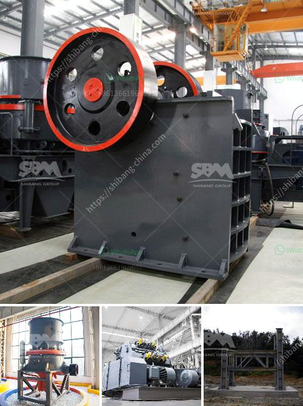

<h3>ore crushers benoni</h3>
In the realm of mining, the ore crusher is an essential piece of machinery. Its primary purpose is to reduce the size of large rocks and minerals extracted from the earth, enabling miners to extract the desired material for further processing. One of the significant players in manufacturing and supplying high-quality ore crushers is Benoni, a city in Gauteng, South Africa.

Benoni has emerged as a hub for various industries, including mining and manufacturing. With its rich mineral deposits and robust mining infrastructure, the city has become synonymous with efficient ore crushers that enhance productivity and streamline mining operations. Let's delve deeper into the significance of ore crushers in Benoni.

First and foremost, ore crushers play a crucial role in efficiently breaking down large rocks into smaller, more manageable sizes. This process is critical as it allows for easier transportation, storage, and further processing of the extracted minerals. Crushers work by applying mechanical force to compress or impact the ore, reducing its size and facilitating easier separation of valuable minerals from the waste material.

Benoni-based ore crushers are renowned for their durability and reliability. The city's manufacturers take immense pride in producing machines that can withstand the challenging conditions inherent in mining operations. These crushers undergo rigorous testing and quality checks to ensure they can withstand high-pressure crushing environments, ensuring seamless and uninterrupted mining operations.

Moreover, ore crushers in Benoni are designed with efficiency in mind. Advanced technologies are incorporated to maximize the yield and minimize energy consumption during the crushing process. This translates not only to enhanced productivity but also reduced operating costs for mining companies. The use of intelligent automation systems further optimizes the crushers' performance, resulting in consistent and reliable output.

Safety is of paramount importance in mining operations, and ore crushers in Benoni adhere to stringent safety regulations. Robust safety features, such as emergency stop buttons and safety guards, are integrated into the machines to protect operators and prevent accidents. Additionally, crushers are designed with easy access for maintenance and repairs, minimizing downtime and enabling swift response to potential issues.

In recent years, environmental concerns have become more prominent in mining operations. The ore crushers in Benoni prioritize eco-friendly measures by incorporating dust suppression systems to reduce air pollution. Furthermore, noise reduction technologies are implemented to minimize noise pollution, ensuring a healthier work environment for operators and nearby communities.

The ore crushers in Benoni have garnered a stellar reputation among miners worldwide. The city's manufacturers have established themselves as trusted suppliers, delivering top-quality crushers that meet and exceed industry standards. Mining companies value the reliability, performance, and longevity of these machines, contributing to improved operational efficiency and profitability.

In conclusion, ore crushers are indispensable in the mining industry, and Benoni has emerged as a leader in manufacturing these essential machines. With a focus on durability, efficiency, and safety, the crushers produced in Benoni enhance mining operations by streamlining the extraction and processing of minerals. As the demand for minerals continues to grow, the city's reputation as a reliable hub for ore crushers is set to further solidify.
<h3>Contact us</h3><ul><li><strong>Whatsapp:&nbsp;<a href="https://wa.me/8613661969651">+8613661969651</a></strong></li><li><a href="https://swt.shibang-china.com/?git&amp;zhl&amp;ore crushers benoni"><strong>Online Service(chat now)</strong></a></li></ul><h3>Related</h3><ul><li><a href='quarry small crusher machine for sale in zimbabwe.md'>quarry small crusher machine for sale in zimbabwe</a></li><li><a href='500 ton per hr crusher price.md'>500 ton per hr crusher price</a></li><li><a href='ball mill servicing agents south africa.md'>ball mill servicing agents south africa</a></li><li><a href='jaw crusher buy in ukraine.md'>jaw crusher buy in ukraine</a></li><li><a href='stone crushing equipment.md'>stone crushing equipment</a></li></ul>