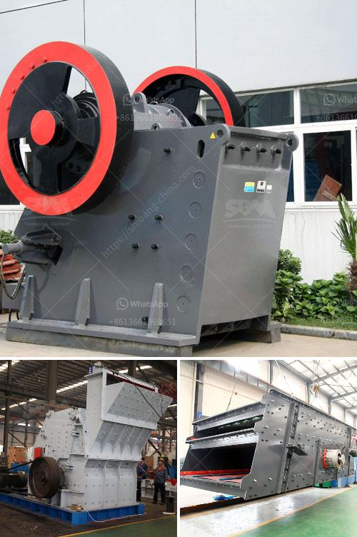

<h3>ore crushing equipment</h3>
Ore crushing equipment plays a pivotal role in the processing of mines and quarries, breaking down large pieces of rock to manageable sizes. These machines have incredible capabilities and are widely used in mining, metallurgy, construction, demolition, and recycling operations. In the past, handling and crushing ore presented a real challenge for both human labor and machinery. However, advancements in technology have paved the way for efficient ore crushing equipment that allows for increased productivity and reduced downtime.

One of the most crucial elements in operating a successful mining operation is ensuring that the machinery used is able to handle the type of ore being processed. Different ores require different coarseness and hardness settings, as well as the ability to withstand high levels of pressure. Therefore, ore crushing equipment must be able to adapt to these unique specifications in order to effectively extract and process minerals.

Today, manufacturers of ore crushing equipment have significantly improved their technology and equipment capabilities making a valuable contribution to the mining industry. Despite the increasing importance of primary crushing equipment, manufacturers continue to invest substantial resources in advanced machining technologies to deliver superior performance and service life.

The latest ore crushing equipment includes HJ series high-efficiency jaw crushers, hydraulic cone crushers, crawler mobile crushing and screening equipment, etc., to meet the diverse needs of customers. They also provide a complete solution for customers in the field of mining, construction, and transportation. Each equipment is systematically researched, developed, manufactured, and sold to guarantee maximum reliability, productivity, and efficiency.

In an industry where dependability matters, manufacturers are introducing energy-efficient and environmentally friendly equipment that also aims to reduce operational costs. By enhancing the productivity and profitability of crushing operations, these machines boost overall efficiency and lower production costs for businesses.

In conclusion, ore crushing equipment plays a vital role in the mining industry. However, advancements in technology have allowed for the development of more sophisticated crushing equipment that offers better precision and reduced operation costs. Manufacturers are investing resources into improving the lifespan and performance of these machines, making them more energy-efficient and environmentally friendly. As the demand for ore materials continues to increase, innovative ore crushing equipment will revolutionize the industry and enhance the extraction process.
<h3>Contact us</h3><ul><li><strong>Whatsapp:&nbsp;<a href="https://wa.me/8613661969651">+8613661969651</a></strong></li><li><a href="https://swt.shibang-china.com/?git&amp;zhl&amp;ore crushing equipment"><strong>Online Service(chat now)</strong></a></li></ul><h3>Related</h3><ul><li><a href='mobile stone crusher from taiwan.md'>mobile stone crusher from taiwan</a></li><li><a href='cement plant cost estimation in india pdf.md'>cement plant cost estimation in india pdf</a></li><li><a href='grinding mill for sale servants.md'>grinding mill for sale servants</a></li><li><a href='iron processing plant for sale.md'>iron processing plant for sale</a></li><li><a href='construction of roller mill.md'>construction of roller mill</a></li></ul>