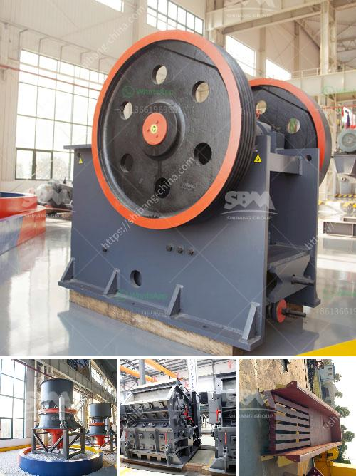

<h3>pakistan quarry crusher manufacturer</h3>
Quarrying and mining is an important sector in Pakistan. In Pakistan, mining industry plays an important role in the development of the country. Quarry and mining sector in Pakistan is crucial for infrastructure development and economic growth. With urbanization, the demand for building materials is increasing day by day. As a result, the demand for quarry crushers manufacturers is also growing.

Pakistan has rich mineral resources, such as copper, iron, limestone, coal, barite, marble, gypsum and so on. These minerals are widely available in different parts of the country, which provides immense opportunities for quarrying and mining. The quarrying and mining industry in Pakistan is regulated by the Pakistan Environmental Protection Agency (Pak-EPA), which ensures that mining activities are conducted in an environmentally friendly and sustainable manner.

To meet the growing demand for building materials and fulfill the infrastructure needs of the country, quarrying companies require reliable and efficient crushing equipment. This is where the role of a quarry crusher manufacturer becomes essential. A quarry crusher manufacturer provides crushing solutions for a variety of industries such as mining, construction, and recycling. They create customized crushing plants that are designed to meet the needs of their customers, ensuring optimal performance and productivity.

One of the prominent quarry crusher manufacturers in Pakistan is SBM. SBM can carry out the full station crushing task in the open pit quarry. SBM has created a series of cost-effective quarry crusher machine, such as jaw crusher, cone crusher, impact crusher, VSI crusher, hammer crusher and gyratory crusher. Their quarry crusher machine has been widely used in mining, metallurgy, building materials, road, railway, water conservancy and chemical industries.

In addition to SBM, there are other quarry crusher manufacturers in Pakistan, such as ISO9001:2000 certified company Hongxing Machinery. It has a strong technical team with more than 40 years of experience in the mining and construction industries. Hongxing Machinery offers a wide range of crushers, such as stone crushers, impact crushers, mobile crushers, jaw crushers, and cone crushers.

Another quarry crusher manufacturer in Pakistan is Kuntang. Kuntang provides a variety of crushing solutions for quarrying, mining, construction, and recycling applications.

The quarry crusher equipment also may be referred to as gravel or rock crushing machine used in quarries and quarry industries, quarry crusher equipment including for primary crushing jaw crusher, two or three stage crushing equipment cone crusher, and sand making machine etc.

Quarry crusher equipment common varieties quarry crusher have jaw crusher,hammer crusher, impact crusher, cone crusher, ball mill, sand making machine, ultrafine grinding mill, the user can according to the hardness of the broken material, maximum feed size, and finished feed size, as well as the size of the venue and circumstances surrounding environment to select the appropriate model and configuration, and provide a full range of technical guidance and support.

In conclusion, the quarry and mining industry plays a vital role in the economic development of Pakistan. To meet the growing demand for building materials, quarry crusher manufacturers need to provide high-quality crushing equipment. Companies like SBM, Hongxing Machinery, and Kuntang are well-known in Pakistan for their reliable and efficient crushing equipment. These manufacturers offer a wide range of crushers that are designed to meet the specific needs of their customers. With the investments and efforts in the mining sector, Pakistan can benefit from its rich mineral resources and achieve sustainable economic growth.
<h3>Contact us</h3><ul><li><strong>Whatsapp:&nbsp;<a href="https://wa.me/8613661969651">+8613661969651</a></strong></li><li><a href="https://swt.shibang-china.com/?git&amp;zhl&amp;pakistan quarry crusher manufacturer"><strong>Online Service(chat now)</strong></a></li></ul><h3>Related</h3><ul><li><a href='small profile format for crusher company.md'>small profile format for crusher company</a></li><li><a href='mini concrete crushers.md'>mini concrete crushers</a></li><li><a href='marble processing machine.md'>marble processing machine</a></li><li><a href='proppant sand crusher manufacturing process.md'>proppant sand crusher manufacturing process</a></li><li><a href='dolomite powder uses in agriculture.md'>dolomite powder uses in agriculture</a></li></ul>