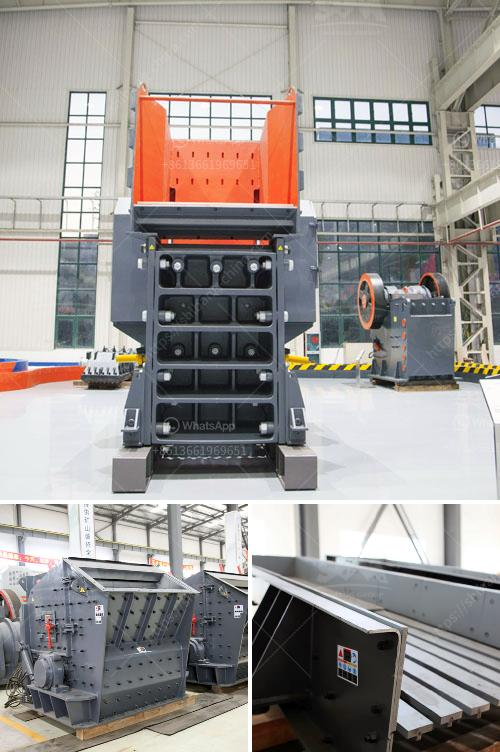

<h3>pe 100x60 jaw crusher for laboratory</h3>
PE 100x60 jaw crusher is a small-sized crushing equipment, which is mainly used for crushing various ores and bulk materials with compression strength of not more than 320Mpa. The equipment is mainly composed of the power transmission, frame, eccentric shaft, movable jaw plate, adjusting device, toggle plate, and other components.

Many laboratories have equipped with PE 100x60 jaw crusher to carry out research and development projects in various fields, such as metallurgy, mining, building materials, chemical industry, coal and other industries. The small size of the equipment makes it easy to move and convenient to operate. It is an ideal choice for laboratory use and small-scale production.

The PE 100x60 jaw crusher has a crusher inlet size of 100×60 mm and a crushing capacity of up to 300 to 500 kg per hour, depending on the material and the input size. The adjustable gap setting allows the crushing size to be easily adjusted to suit the specific requirements of the project. With a motor power of 1.5 kW, the crusher is capable of crushing even the hardest materials efficiently.

One of the key features of the PE 100x60 jaw crusher is its simplicity in design and operation. The equipment is easy to use and maintain, requiring minimal training and maintenance. The jaw crusher is equipped with a safety device, which ensures that the equipment operates safely and efficiently. In case of overload or material blockage, the safety device will automatically release the pressure to protect the crusher from damage.

The PE 100x60 jaw crusher is also known for its high reliability and durability. Its robust construction enables it to withstand the toughest of materials and harsh working environments. The heavy-duty design ensures that the equipment can handle heavy loads and continuous operation without any issues. With proper care and maintenance, the jaw crusher can have a long service life, providing great value for money.

In conclusion, the PE 100x60 jaw crusher is a reliable and efficient piece of equipment that is ideal for laboratory use. Its small size, simplicity in design and operation, and high reliability make it a valuable asset for researchers and scientists in various fields. Whether used for research purposes or small-scale production projects, the PE 100x60 jaw crusher provides efficient and reliable crushing capabilities.
<h3>Contact us</h3><ul><li><strong>Whatsapp:&nbsp;<a href="https://wa.me/8613661969651">+8613661969651</a></strong></li><li><a href="https://swt.shibang-china.com/?git&amp;zhl&amp;pe 100x60 jaw crusher for laboratory"><strong>Online Service(chat now)</strong></a></li></ul><h3>Related</h3><ul><li><a href='iron ore crusher in pakistan.md'>iron ore crusher in pakistan</a></li><li><a href='suppliers of conveyor belts in malaysia.md'>suppliers of conveyor belts in malaysia</a></li><li><a href='used jaw crushers for sale in florida.md'>used jaw crushers for sale in florida</a></li><li><a href='dolomite mining crusher process.md'>dolomite mining crusher process</a></li><li><a href='mining equipment suppliers in south korea.md'>mining equipment suppliers in south korea</a></li></ul>