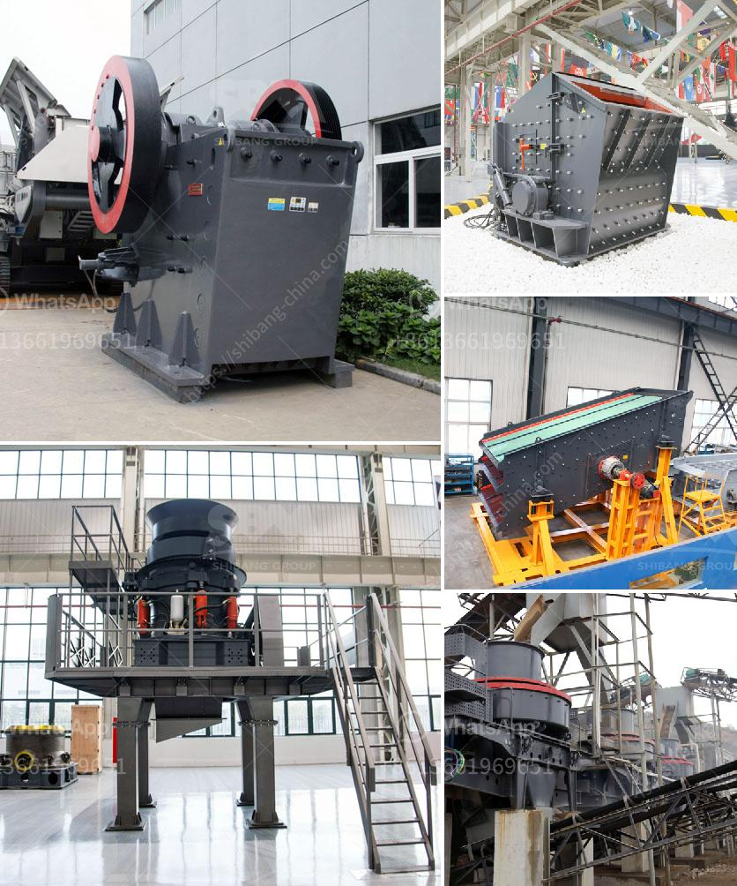

<h3>pe jaw crusher stone jaw crusher for rock crushing</h3>
PE jaw crusher, also known as stone jaw crusher, is a highly efficient crushing machine that is widely used in the mining and construction industry. It is suitable for primary and secondary crushing of minerals and rocks with compressive strength less than 320 MPa.

PE jaw crusher is mainly composed of frame, eccentric shaft, large pulley, flywheel, movable jaw, side guard plate, toggle plate, toggle plate backseat, adjust gap screw, reset spring, fixed jaw and movable jaw plate. The crushing cavity is deep and has no dead zone, which improves the feeding capacity and productivity. The materials enter the crushing chamber from the top, and are crushed between the fixed jaw and the movable jaw. The crushed materials are discharged through the bottom discharge port.

This stone jaw crusher has a simple structure, reliable operation, and low operating costs. Its energy-saving equipment stand-alone energy-saving 15% to 30%, saving more than double. The system can save more than half of the energy consumed in traditional crushing.

PE jaw crusher can process various rocks with a compressive strength not exceeding 320MPa, such as granite, quartz stone, basalt, pebble and other stones. It is a commonly used equipment in the mining and metallurgical industries.

The PE jaw crusher has a significant crushing efficiency with a large crushing ratio and a high output, which is favored by the majority of users. In the process of crushing, various materials are crushed to achieve the desired particle size. The crushed materials are discharged from the lower discharge port, and the production efficiency is high.

In conclusion, the PE jaw crusher is a piece of ideal equipment for crushing stones. It has been widely used in mining, metallurgy, building materials, highway, railway, water conservancy and other departments. It is an efficient and energy-saving rock crushing equipment that saves about 15%-30% energy compared with the traditional jaw crusher.
<h3>Contact us</h3><ul><li><strong>Whatsapp:&nbsp;<a href="https://wa.me/8613661969651">+8613661969651</a></strong></li><li><a href="https://swt.shibang-china.com/?git&amp;zhl&amp;pe jaw crusher stone jaw crusher for rock crushing"><strong>Online Service(chat now)</strong></a></li></ul><h3>Related</h3><ul><li><a href='quartz production process.md'>quartz production process</a></li><li><a href='100 tph cobble crushing plant.md'>100 tph cobble crushing plant</a></li><li><a href='sale 42 jaw crusher in india.md'>sale 42 jaw crusher in india</a></li><li><a href='list of crusher industry in nepal.md'>list of crusher industry in nepal</a></li><li><a href='stone crushers in south africa.md'>stone crushers in south africa</a></li></ul>