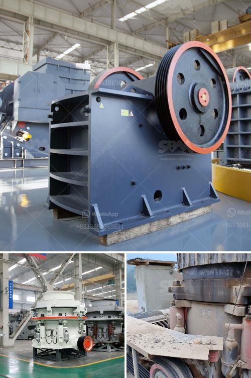

<h3>pebble crushing processing</h3>
Pebble crushing processing serves as an essential step in extracting valuable minerals from ore. The process involves breaking down the ore into smaller pieces to facilitate efficient extraction. This article highlights the significance of pebble crushing processing and its impact on optimizing efficiency and output.

First and foremost, pebble crushing processing plays a crucial role in reducing the size of ore particles. By breaking down larger pebbles into smaller ones, the process significantly increases the surface area available for chemical reaction and subsequent extraction. This helps to maximize the yield of valuable minerals, such as gold, copper, or nickel, from the ore.

Additionally, pebble crushing processing aids in improving the overall efficiency of mineral extraction. Smaller ore particles allow for a more uniform distribution within the flotation tanks or leaching vats, ensuring more effective contact between the ore and the chemical solvent. This enhanced contact accelerates the dissolution of minerals, expediting the extraction process.

Moreover, pebble crushing processing contributes to the production of high-quality concentrates. By reducing the size of ore particles, the process helps to eliminate impurities and unwanted minerals. This selective crushing ensures that the final concentrate obtained is of superior quality, enhancing its economic value.

To optimize efficiency and output in pebble crushing processing, various factors must be considered. An efficient crushing circuit design, using advanced equipment such as cone crushers or high-pressure rolls, can help achieve the desired particle size reduction. Close attention should also be given to the selection of appropriate crushing media, ensuring optimal performance and minimal maintenance requirements.

Furthermore, pebble crushing processing can be fine-tuned by adjusting parameters such as the feed rate, crusher speed, and closed-side setting. These adjustments optimize the crushing process and facilitate the achievement of the desired product specification, while maximizing overall plant efficiency.

In conclusion, pebble crushing processing forms an integral part of mineral extraction, enabling efficient yield of valuable minerals. By reducing the size of ore particles, enhancing the concentration of minerals, and optimizing efficiency, pebble crushing processing significantly contributes to the overall success of mining operations.
<h3>Contact us</h3><ul><li><strong>Whatsapp:&nbsp;<a href="https://wa.me/8613661969651">+8613661969651</a></strong></li><li><a href="https://swt.shibang-china.com/?git&amp;zhl&amp;pebble crushing processing"><strong>Online Service(chat now)</strong></a></li></ul><h3>Related</h3><ul><li><a href='sayaji jaw crusher manufacturer.md'>sayaji jaw crusher manufacturer</a></li><li><a href='model project of stone powder.md'>model project of stone powder</a></li><li><a href='chrome washing plant new technology.md'>chrome washing plant new technology</a></li><li><a href='south africa suppliers of chrome ore beneficiation plant.md'>south africa suppliers of chrome ore beneficiation plant</a></li><li><a href='coal washing plant supplier south africa.md'>coal washing plant supplier south africa</a></li></ul>