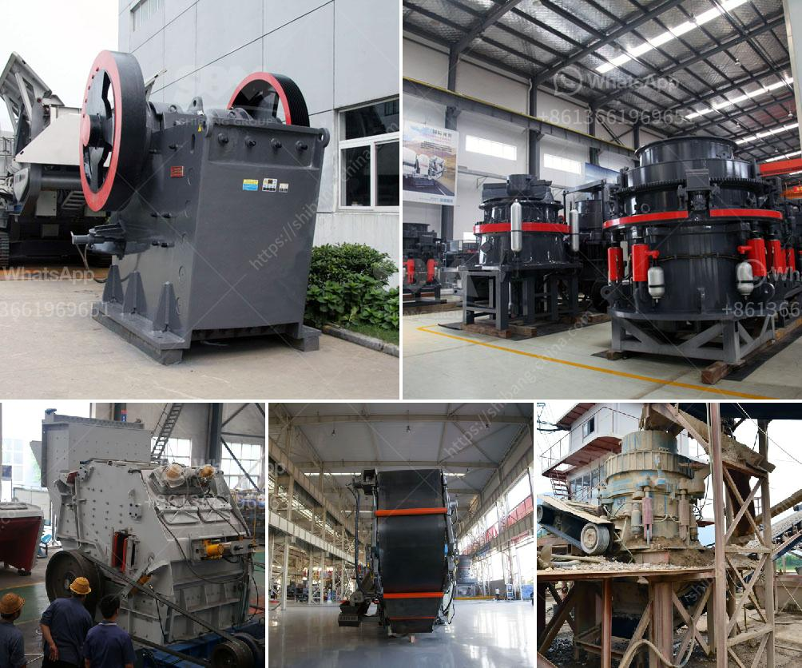

<h3>petimex impact crushers manial petite</h3>
When it comes to crushing and reducing the size of materials, Petimex Impact Crushers are the perfect choice. These advanced machines are designed to deliver powerful impact forces, transforming even the toughest materials into fine particles. With their high efficiency and reliability, Petimex Impact Crushers ensure optimal crushing performance, making them an essential tool for various industries.

One key feature of Petimex Impact Crushers is their versatility, as they can handle a wide range of materials, including ores, rocks, and even recycled concrete. This flexibility makes them suitable for use in construction sites, mining operations, and recycling facilities. Whether you need to crush hard stones or process demolished buildings, Petimex Impact Crushers are up to the task, delivering exceptional results every time.

Another notable advantage of Petimex Impact Crushers is their ease of maintenance. With their robust design and high-quality components, these machines require minimal upkeep, ensuring reduced downtime and efficiency in your operations. Additionally, their user-friendly interface allows for quick and hassle-free adjustments, saving valuable time and ensuring maximum productivity.

Petimex Impact Crushers are not only efficient but also safe to operate. Equipped with advanced safety features and reliable mechanisms, these crushers prioritize the well-being of operators. From the emergency stop function to the intelligent design that prevents uncrushable objects from entering the crushing chamber, Petimex Impact Crushers ensure a secure working environment.

Furthermore, Petimex Impact Crushers are known for their low operational costs. With their energy-efficient design, these machines consume less power, resulting in reduced electricity bills. Additionally, their durable construction and long-lasting parts guarantee extended service life, further decreasing maintenance expenses.

In conclusion, Petimex Impact Crushers provide an ideal solution for all your crushing needs. With their versatility, reliability, ease of maintenance, and safety features, these machines deliver exceptional results for industries such as construction, mining, and recycling. Moreover, their cost-effectiveness makes them a worthwhile investment for companies looking to optimize their crushing operations. So, if you are in need of a reliable and efficient crushing solution, Petimex Impact Crushers are the answer.
<h3>Contact us</h3><ul><li><strong>Whatsapp:&nbsp;<a href="https://wa.me/8613661969651">+8613661969651</a></strong></li><li><a href="https://swt.shibang-china.com/?git&amp;zhl&amp;petimex impact crushers manial petite"><strong>Online Service(chat now)</strong></a></li></ul><h3>Related</h3><ul><li><a href='cost of setting up a cement plant in usa.md'>cost of setting up a cement plant in usa</a></li><li><a href='roll mill manufacturere in mumbai.md'>roll mill manufacturere in mumbai</a></li><li><a href='design calculation of the jaw crusher pdf.md'>design calculation of the jaw crusher pdf</a></li><li><a href='mineral beneficiation screening ppt.md'>mineral beneficiation screening ppt</a></li><li><a href='coal crusherton per hours.md'>coal crusherton per hours</a></li></ul>