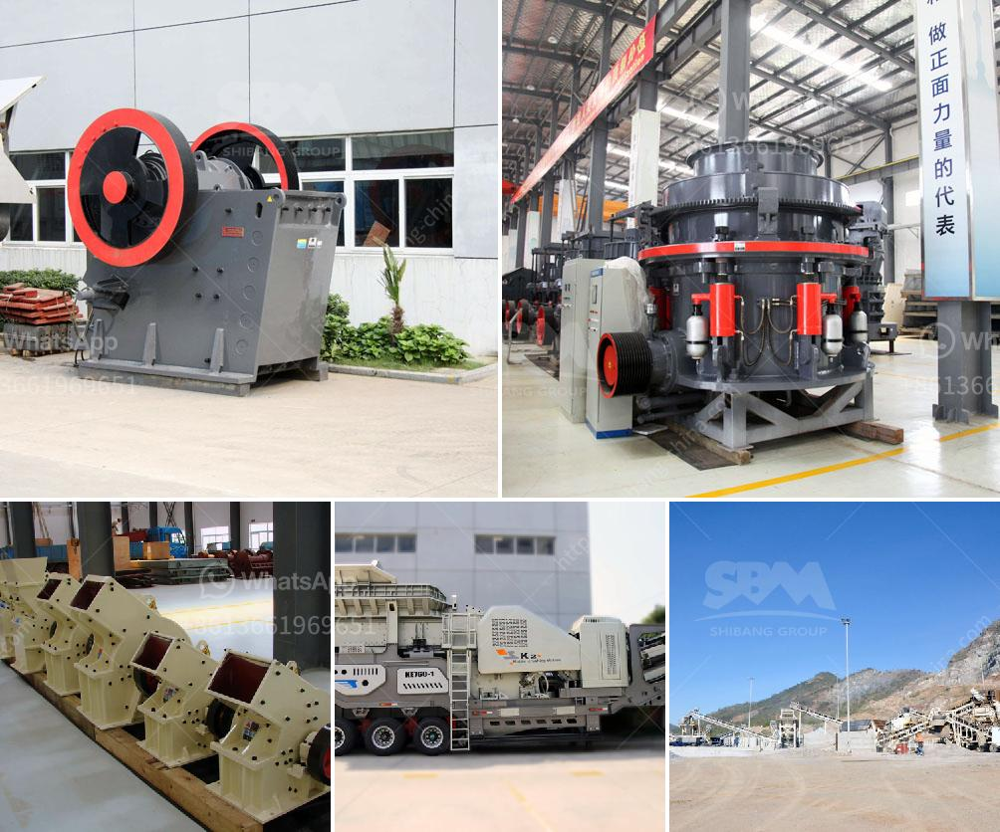

<h3>petitpierre 20tph rapport de projet</h3>
Le projet Petitpierre 20tph est un projet de fabrication de machines industriels d'une capacité de 20 tonnes par heure. Ce rapport de projet vise à fournir un aperçu complet du projet, en mettant l'accent sur les objectifs, les aspects techniques, les coûts estimés et les délais de réalisation.

L'objectif principal de ce projet est de répondre à la demande croissante de machines industrielles dans divers secteurs tels que l'agroalimentaire, la chimie et la pharmacie. La capacité de production de 20 tonnes par heure sera suffisante pour répondre à cette demande et permettra aux entreprises d'accroître leur efficacité et leur productivité.

Sur le plan technique, le projet Petitpierre 20tph prévoit la conception et la construction de machines industrielles robustes et fiables. Ces machines seront équipées de technologies de pointe pour assurer des performances optimales et une utilisation facile. Des spécialistes techniques qualifiés seront engagés pour garantir la qualité et la conformité des machines fabriquées.

En ce qui concerne les coûts estimés, le projet nécessitera un investissement initial substantiel pour l'achat de matériaux, l'embauche de personnel et l'acquisition d'équipements de production. Cependant, une analyse financière approfondie a montré que le retour sur investissement pourrait être réalisé en moins de cinq ans grâce à une demande importante et à des marges bénéficiaires élevées.

Quant aux délais de réalisation, le projet est divisé en plusieurs phases, notamment la conception, la construction, les tests et la mise en service. Chaque phase sera minutieusement planifiée et suivie de près pour garantir les délais de livraison prévus. Une équipe de gestion de projet sera mise en place pour coordonner toutes les activités et s'assurer du respect des échéances.

En conclusion, le projet Petitpierre 20tph est une initiative prometteuse pour répondre à la demande croissante de machines industrielles performantes. Avec une capacité de production de 20 tonnes par heure, ce projet permettra aux entreprises d'accroître leur efficacité et leur productivité. Bien que cela nécessite un investissement initial substantiel, les avantages financiers attendus justifient l'effort. En suivant une planification minutieuse et en maintenant des délais stricts, ce projet a le potentiel de réussir et de devenir un acteur majeur dans le secteur des machines industrielles.
<h3>Contact us</h3><ul><li><strong>Whatsapp:&nbsp;<a href="https://wa.me/8613661969651">+8613661969651</a></strong></li><li><a href="https://swt.shibang-china.com/?git&amp;zhl&amp;petitpierre 20tph rapport de projet"><strong>Online Service(chat now)</strong></a></li></ul><h3>Related</h3><ul><li><a href='diamond wash plants for sale in south africa.md'>diamond wash plants for sale in south africa</a></li><li><a href='raymond mill roll asembley.md'>raymond mill roll asembley</a></li><li><a href='cement plant production line.md'>cement plant production line</a></li><li><a href='crusher plant for sale china.md'>crusher plant for sale china</a></li><li><a href='secondary rock crusher.md'>secondary rock crusher</a></li></ul>