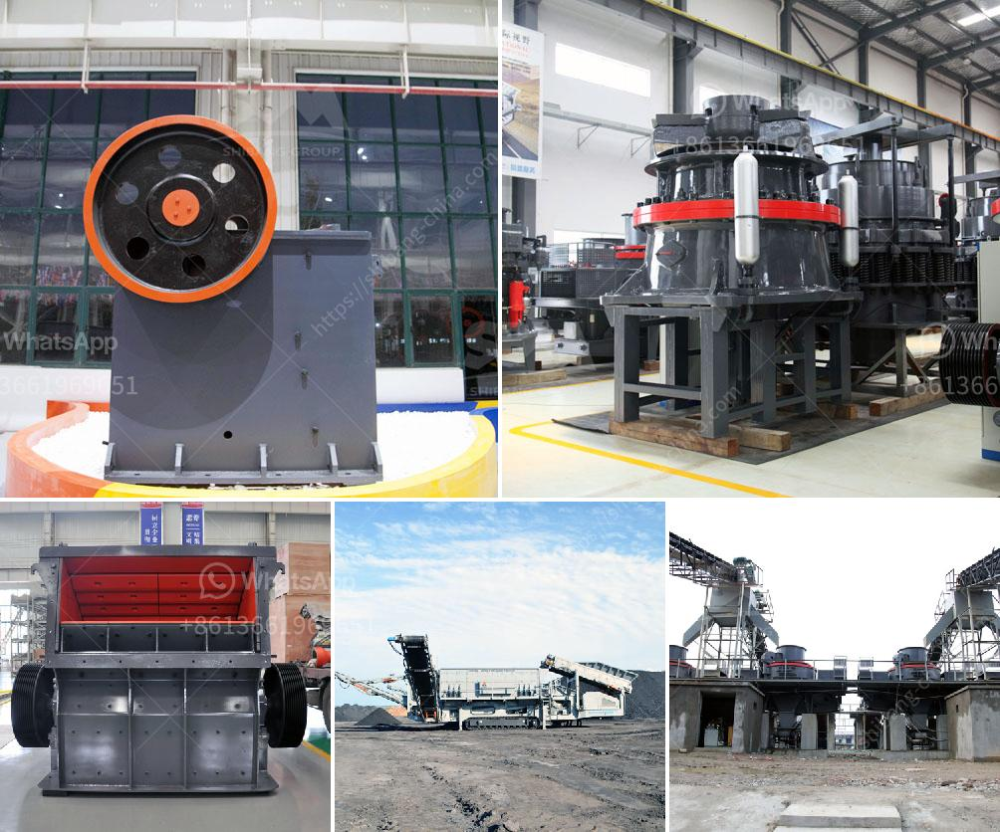

<h3>piedra maquinaria agregada equipos de bolivia</h3>
Los equipos de maquinaria agregada son una parte crucial de la industria de la construcción en Bolivia. Estos equipos están diseñados para triturar, moler y clasificar diferentes tipos de piedra y materiales de construcción, como grava, arena y rocas. La demanda de estos equipos ha aumentado en los últimos años debido al crecimiento constante de la industria de la construcción en el país.

En Bolivia, existen diversas empresas que se dedican a la fabricación y venta de maquinaria agregada. Estas empresas ofrecen una amplia gama de equipos, desde trituradoras y molinos hasta cribadoras y transportadores. Los equipos son utilizados en la construcción de carreteras, edificios, puentes y otros proyectos de infraestructura.

La calidad y eficiencia de los equipos de maquinaria agregada es fundamental para garantizar un buen rendimiento en los proyectos de construcción. Muchas empresas en Bolivia se han destacado por ofrecer equipos de alta calidad que cumplen con los estándares internacionales de la industria. Estos equipos son fabricados con materiales duraderos y tecnología avanzada, lo que los hace más eficientes y confiables.

La adquisición de equipos de maquinaria agregada en Bolivia puede ser beneficiosa para las empresas constructoras, ya que les permite mejorar su capacidad de producción y reducir los costos. Contar con equipos propios también brinda mayor flexibilidad y control sobre los proyectos en términos de programación y calidad del producto final.

En resumen, los equipos de maquinaria agregada tienen un papel fundamental en la industria de la construcción en Bolivia. Estos equipos ayudan a triturar, moler y clasificar diferentes tipos de piedra y materiales de construcción, garantizando un rendimiento eficiente en los proyectos. La adquisición de estos equipos puede ser una inversión inteligente para las empresas del sector, permitiéndoles mejorar su capacidad de producción y reducir costos.
<h3>Contact us</h3><ul><li><strong>Whatsapp:&nbsp;<a href="https://wa.me/8613661969651">+8613661969651</a></strong></li><li><a href="https://swt.shibang-china.com/?git&amp;zhl&amp;piedra maquinaria agregada equipos de bolivia"><strong>Online Service(chat now)</strong></a></li></ul><h3>Related</h3><ul><li><a href='small slag crushing plant manufacturers in delhi.md'>small slag crushing plant manufacturers in delhi</a></li><li><a href='how to setting up of stone crusher unit.md'>how to setting up of stone crusher unit</a></li><li><a href='secondary crushing cone crusher drawings.md'>secondary crushing cone crusher drawings</a></li><li><a href='micro powder grinding mill.md'>micro powder grinding mill</a></li><li><a href='hammer mills for bricks and blocks.md'>hammer mills for bricks and blocks</a></li></ul>