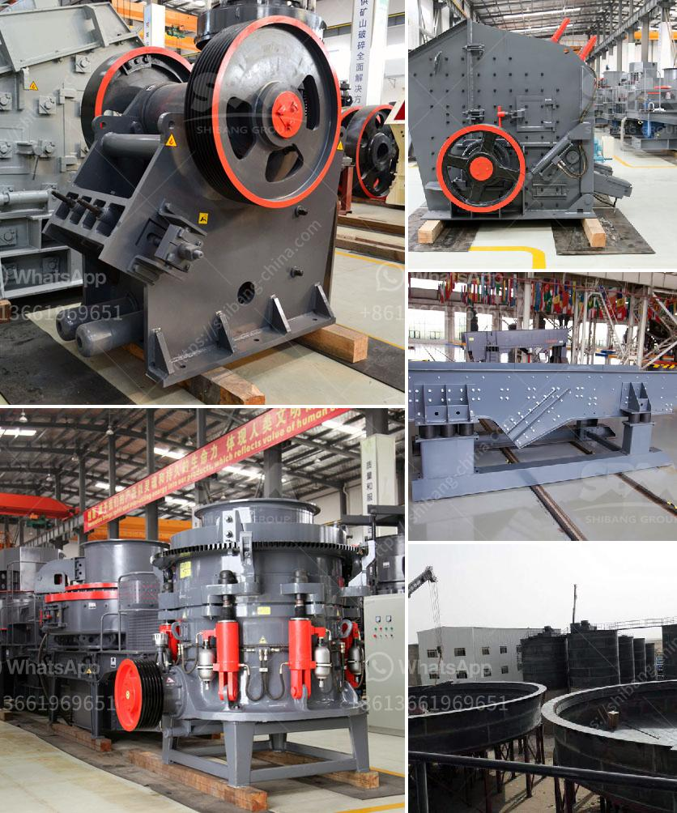

<h3>placer mining wash plant operating costs</h3>
Placer mining is a mining method commonly used in gold mining operations. This method involves extracting alluvial deposits of precious minerals, such as gold and gemstones, from loose sediments or gravels found in riverbeds or other geological features.

One essential piece of equipment used in placer mining is the wash plant. It is a mechanical device used to separate minerals from their surrounding materials, usually through trommel screening and gravity separation. The wash plant is vital for efficient and profitable placer mining operations.

Operating costs associated with a placer mining wash plant can vary widely depending on the size and scale of the operation. Typically, larger operations with more extensive equipment and a higher production capacity will have higher operating costs compared to smaller-scale operations.

1. Equipment Maintenance and Repairs: Regular maintenance and repairs are essential to ensure the efficient operation of a wash plant. This includes routine inspections, replacement of worn-out parts, and repairs to address any mechanical or electrical issues. The cost of maintenance and repairs can vary depending on the complexity of the equipment and the skill level required for repairs.

2. Fuel and Power Costs: Placer mining wash plants require a significant amount of fuel and power to operate effectively. This includes powering the trommel screens, water pumps, conveyor belts, and other machinery. The cost of fuel and electricity will depend on the local rates and availability.

3. Labor Costs: Placer mining wash plants require a team of skilled laborers to operate and maintain the equipment. Labor costs can vary depending on the number of workers, their qualifications, and the hours worked. Additionally, remote mining operations might incur additional expenses, such as providing accommodations or transportation for workers.

4. Water Usage and Disposal: Water is a crucial component of placer mining wash plants, as it is used to wash and separate the valuable minerals from the sediments. The cost of water usage and treatment or disposal will depend on local regulations, the availability of water sources, and the technology used to recycle or treat the water.

5. Environmental Compliance: Placer mining operations must adhere to environmental regulations and obtain permits. Compliance with these regulations might involve conducting environmental impact assessments, monitoring water quality, and implementing waste management plans. The cost of complying with these regulations can vary depending on the jurisdiction and the complexity of the operation.

In conclusion, operating costs for placer mining wash plants can vary widely depending on the size, scale, and location of the operation. It is crucial for miners to carefully consider equipment maintenance, fuel and power costs, labor costs, water usage and treatment, and environmental compliance to calculate accurate operating costs. By managing these expenses effectively, placer miners can maximize profitability and ensure the long-term sustainability of their operations.
<h3>Contact us</h3><ul><li><strong>Whatsapp:&nbsp;<a href="https://wa.me/8613661969651">+8613661969651</a></strong></li><li><a href="https://swt.shibang-china.com/?git&amp;zhl&amp;placer mining wash plant operating costs"><strong>Online Service(chat now)</strong></a></li></ul><h3>Related</h3><ul><li><a href='allis chalmers gyratory crushers.md'>allis chalmers gyratory crushers</a></li><li><a href='safety operation of crusher.md'>safety operation of crusher</a></li><li><a href='clay mill roller balancing.md'>clay mill roller balancing</a></li><li><a href='ball mill for lead processing companies list.md'>ball mill for lead processing companies list</a></li><li><a href='4 rolar raymond mill productions.md'>4 rolar raymond mill productions</a></li></ul>