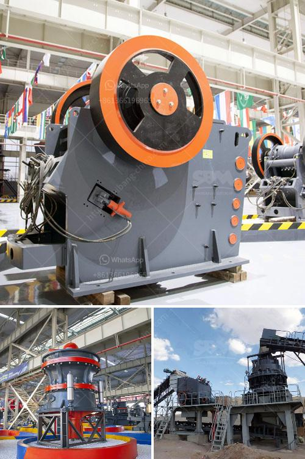

<h3>plant grinder mill price</h3>
For gardening enthusiasts and botany lovers, acquiring a plant grinder mill can be a game-changer. This handy tool serves as a crucial accessory to process various plant materials, rendering them into the desired consistency. Whether you want to create homemade compost, extract essential oils, or prepare herbal remedies, a plant grinder mill is a versatile addition to your toolkit. Moreover, with the increasing popularity of sustainable living and self-sufficiency, owning one has become an essential requirement for many individuals.

One factor that often comes to mind when considering a plant grinder mill is the price range. Luckily, there are options available in the market to suit every budget. With a little bit of research and a clear understanding of your requirements, you can find a cost-effective solution without compromising on quality.

In the range of $100 to $300, you can discover a wide array of plant grinder mills that cater to different needs. These mid-range models often come equipped with multi-purpose functionalities, allowing you to grind or crush various materials effortlessly. Whether you are dealing with small herbs or larger plant parts, a mid-range grinder mill can handle the job with ease.

While it is important to keep your budget in mind, it is equally vital to consider the durability and performance of the plant grinder mill you choose. Opting for a slightly higher price within this range can ensure a more durable and long-lasting investment, saving you money in the long run. It is crucial to read product reviews and features carefully to make an informed decision.

Investing in a plant grinder mill provides an opportunity to harness the full potential of your garden or botanical endeavors. With a cost-effective option readily available in the $100 to $300 price range, you can fulfill your gardening dreams without breaking the bank. So, embrace your green thumb and explore the possibilities that lie within this essential gardening tool.
<h3>Contact us</h3><ul><li><strong>Whatsapp:&nbsp;<a href="https://wa.me/8613661969651">+8613661969651</a></strong></li><li><a href="https://swt.shibang-china.com/?git&amp;zhl&amp;plant grinder mill price"><strong>Online Service(chat now)</strong></a></li></ul><h3>Related</h3><ul><li><a href='mineral beneficiation screening ppt.md'>mineral beneficiation screening ppt</a></li><li><a href='artificial stone production plant in turkey.md'>artificial stone production plant in turkey</a></li><li><a href='crusher in malaysia.md'>crusher in malaysia</a></li><li><a href='ultra fine mill price.md'>ultra fine mill price</a></li><li><a href='tata stone crusher machines nairobi.md'>tata stone crusher machines nairobi</a></li></ul>