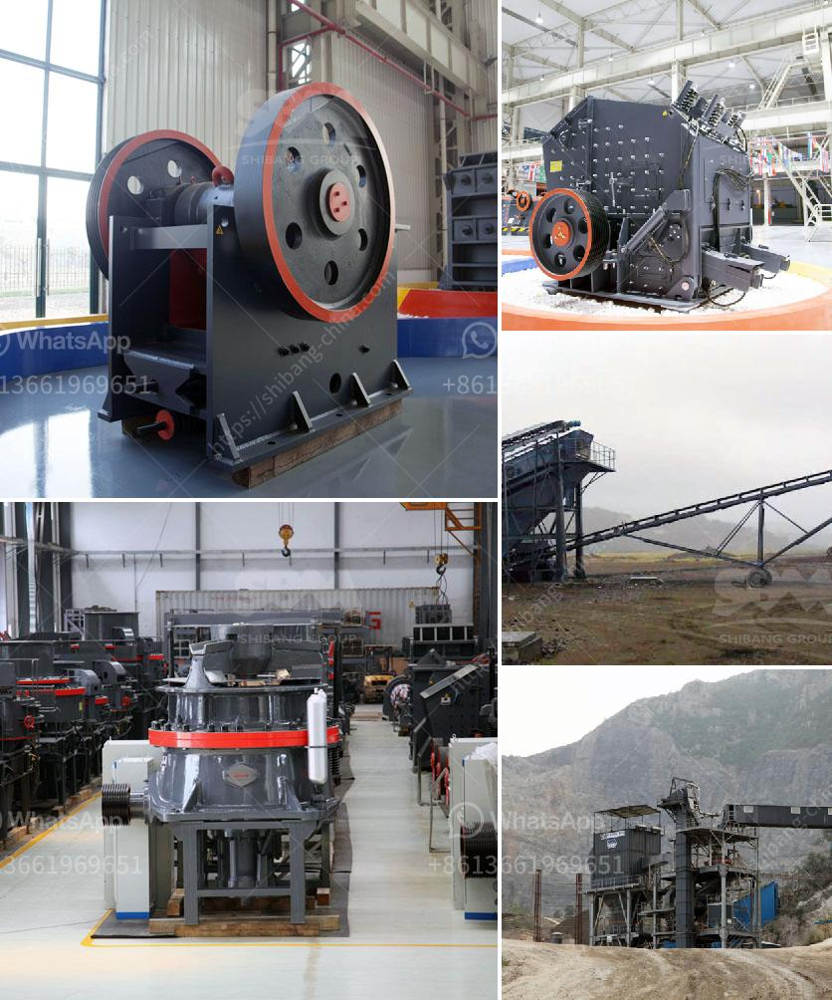

<h3>portable cedar rapids rock crusher</h3>
A portable cedar rapids rock crusher is the perfect machine for conducting onsite crushing. This particular crusher is powered by a hydraulic system and features a vibrating feeder that’s adjustable, an 18” x 36” jaw crusher, a side discharge conveyor, and a diesel-powered generator.

This rock crusher is a reliable and easy-to-use machine that has been specifically made for the mining and construction industry. With a capacity of up to 300 tons per hour and a maximum feed size of up to 24”, it ensures efficient and reliable operation. The crusher can also be adjusted to produce different sizes of crushed material, making it perfect for various applications.

One of the biggest advantages of this cedar rapids rock crusher is its portability. It can be easily transported to different sites, enabling professionals to take it wherever they need to go for efficient crushing on the spot. This eliminates the need for expensive transportation costs and allows for immediate crushing, saving time and money.

Additionally, this portable rock crusher is designed with safety in mind. It features a remote control function that allows operators to stay at a safe distance while controlling the crusher. This ensures the safety of the operators and reduces the risk of accidents.

In conclusion, a portable cedar rapids rock crusher is an excellent machine for conducting crushing on-site. It allows for efficient and reliable operation with minimal effort. This crusher can be easily transported to different sites, making it suitable for various applications. With its safety features and adjustable capabilities, it is a valuable addition to any mining or construction operation.
<h3>Contact us</h3><ul><li><strong>Whatsapp:&nbsp;<a href="https://wa.me/8613661969651">+8613661969651</a></strong></li><li><a href="https://swt.shibang-china.com/?git&amp;zhl&amp;portable cedar rapids rock crusher"><strong>Online Service(chat now)</strong></a></li></ul><h3>Related</h3><ul><li><a href='china vertical roller mill.md'>china vertical roller mill</a></li><li><a href='pe jaw crusher stone jaw crusher for rock crushing.md'>pe jaw crusher stone jaw crusher for rock crushing</a></li><li><a href='rent a conveyor belts singapur.md'>rent a conveyor belts singapur</a></li><li><a href='project cost of 100 tpd opc cement plant.md'>project cost of 100 tpd opc cement plant</a></li><li><a href='for sale used mobile jaw crusher philippines.md'>for sale used mobile jaw crusher philippines</a></li></ul>