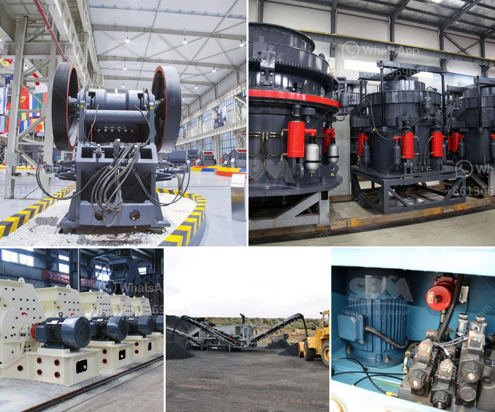

<h3>portable concrete crusher construction waste</h3>
Construction waste is a growing problem globally. With rapid urbanization and industrialization, the amount of construction waste generated is increasing at an alarming rate. Traditional disposal methods, such as landfilling and incineration, are becoming less desirable due to their negative environmental impacts. However, there is a solution to this problem – the portable concrete crusher.

A portable concrete crusher is a mobile crushing device that can autonomously crushs various types of construction waste such as concrete, bricks, tiles, scrap metal, mortar, and more, reducing the volume of waste and improving its reuse potential. The crushed construction waste can be used as filling material, aggregate, or even recycled into new concrete.

One of the key advantages of portable concrete crushers is their compact size and ability to be transported easily. This makes them highly versatile for various construction sites, especially those with limited space. Additionally, portable crushers can be set up and dismantled quickly, allowing for efficient waste management on the go.

Another benefit of portable concrete crushers is their eco-friendly nature. By crushing and recycling construction waste, these crushers help in reducing the need for raw materials, such as gravel and sand, which are non-renewable resources. This leads to a more sustainable construction industry and lowers the carbon footprint associated with new construction.

Furthermore, portable concrete crushers offer cost savings to construction companies. Instead of hiring a separate waste management service or transportation for construction waste, companies can simply invest in their own portable crusher. This eliminates additional expenses and streamline the construction process.

In conclusion, portable concrete crushers are the ideal solution for construction waste management. They provide a convenient, environmentally friendly, and cost-effective way of reducing construction waste and promoting sustainability in the construction industry. With the growing emphasis on environmental conservation, investing in a portable concrete crusher is a wise decision for any construction company.
<h3>Contact us</h3><ul><li><strong>Whatsapp:&nbsp;<a href="https://wa.me/8613661969651">+8613661969651</a></strong></li><li><a href="https://swt.shibang-china.com/?git&amp;zhl&amp;portable concrete crusher construction waste"><strong>Online Service(chat now)</strong></a></li></ul><h3>Related</h3><ul><li><a href='used stone crusher in germany.md'>used stone crusher in germany</a></li><li><a href='land requirement for mini cement plant.md'>land requirement for mini cement plant</a></li><li><a href='small crusher project.md'>small crusher project</a></li><li><a href='machine de fabrication de sable de platre.md'>machine de fabrication de sable de platre</a></li><li><a href='primary jaw crusher.md'>primary jaw crusher</a></li></ul>