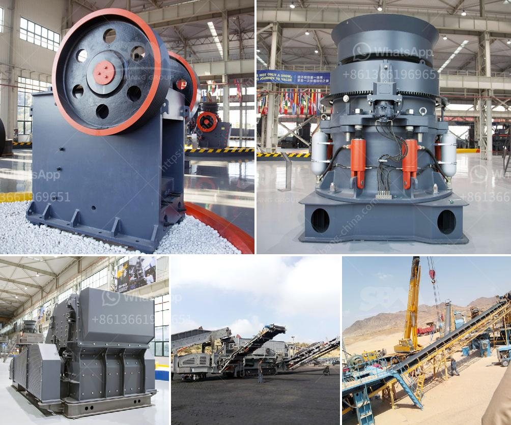

<h3>portable hard rock mining</h3>
The mining industry has witnessed tremendous advancements in technology over the years. From traditional open-pit mining to underground shaft mining, the methods have evolved to extract precious minerals and metals from the earth's surface effectively. However, a groundbreaking innovation that is revolutionizing the industry is the concept of portable hard rock mining.

Portable hard rock mining involves the use of compact, mobile equipment that can be easily transported to various mining sites. These portable machines are specifically designed to extract minerals and metals from hard rock formations, which were previously considered inaccessible or uneconomical.

One of the key advantages of portable hard rock mining is its mobility. Traditional mining methods often involve setting up large, permanent infrastructure at a specific location, which is both time-consuming and expensive. In contrast, portable hard rock mining allows miners to quickly relocate their operations based on changing market conditions or the discovery of new mineral deposits. This flexibility ensures optimal resource utilization and improved profitability.

Furthermore, portable hard rock mining equipment is highly efficient, making it possible to extract larger quantities of valuable minerals in a shorter time frame. Advanced drilling and blasting techniques, along with innovative crushing and screening technologies, allow for the extraction of ore with high precision and accuracy.

Despite its small size, portable mining equipment offers powerful capabilities. Sophisticated machinery, such as portable crushers, drill rigs, and conveyor systems, can crush and transport large volumes of ore from the excavation site with ease. This not only increases productivity but also reduces labor requirements and costs.

Additionally, portable hard rock mining has significant environmental benefits. Traditional mining methods often involve extensive excavation, resulting in deforestation and habitat destruction. In contrast, portable mining techniques require smaller excavation sites, minimizing the ecological footprint and preserving the natural environment.

In conclusion, portable hard rock mining represents the future of the mining industry. The mobility, efficiency, and environmental advantages it offers make it an attractive alternative to conventional mining methods. With ongoing advancements in technology, portable mining equipment will continue to evolve and redefine the way minerals and metals are extracted from the earth.
<h3>Contact us</h3><ul><li><strong>Whatsapp:&nbsp;<a href="https://wa.me/8613661969651">+8613661969651</a></strong></li><li><a href="https://swt.shibang-china.com/?git&amp;zhl&amp;portable hard rock mining"><strong>Online Service(chat now)</strong></a></li></ul><h3>Related</h3><ul><li><a href='jaw crusher supplier in jakarta.md'>jaw crusher supplier in jakarta</a></li><li><a href='mobile stone crusher plant on hire in india.md'>mobile stone crusher plant on hire in india</a></li><li><a href='crusher in argentina stone crusher.md'>crusher in argentina stone crusher</a></li><li><a href='jaw crusher materials.md'>jaw crusher materials</a></li><li><a href='small rock gravel crushers.md'>small rock gravel crushers</a></li></ul>