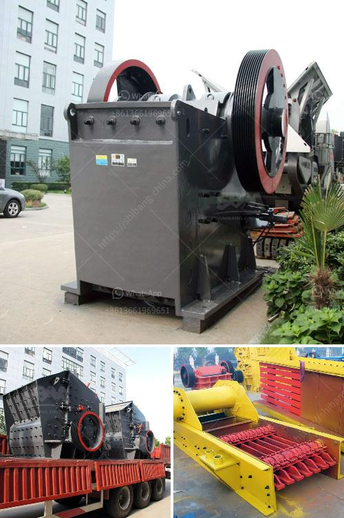

<h3>portable jaw crusher</h3>
A portable jaw crusher is a versatile machine that enables crushing and screening operations on-site. This equipment is highly sought after by contractors and quarry operators for its versatility and efficiency. As the name suggests, a portable jaw crusher can be easily moved from one site to another, making it suitable for civil engineering works such as road construction, urban infrastructure, and more. It is an essential tool in the demolition and recycling industry as well.

One of the primary advantages of a portable jaw crusher is its ability to crush large rocks into smaller aggregate pieces. Crushed aggregate is essential for the construction of roads, bridges, buildings, and other infrastructure projects. With a portable jaw crusher, contractors can efficiently break down materials on-site, minimizing transportation costs and reducing the need for additional equipment.

The portable jaw crusher is operated by electric motors, which drive the crusher components. In order to effectively meet site demands, the crusher hopper should be appropriately sized and loaded. The feeder controls the rate of materials feeding to the crusher, ensuring efficient crushing performance. The jaw crusher discharges the materials onto a conveyor belt for transport to the next stage of the operation, such as a screening plant or stockpile.

Portable jaw crushers are often used in aggregate production and recycling applications, such as construction and demolition waste recycling, which involves concrete, asphalt, and brick debris. It is also an excellent choice for primary crushing when processing hard rock, such as granite or basalt. However, portable jaw crushers can also be utilized in mining operations, quarrying applications, and recycling of materials for the construction industry.

The mobility and compact size of portable jaw crushers make them suitable for working in tight spaces, allowing operators to easily maneuver the machine around the job site. Additionally, the reduced footprint and lower weight of portable jaw crushers make them highly transportable, enabling quick and efficient setup at different locations.

To ensure the longevity and reliable performance of a portable jaw crusher, regular maintenance is crucial. This includes inspecting and cleaning the crusher regularly, checking and tightening the bolts, lubricating the bearings, and replacing worn-out parts. Following the manufacturer's guidelines and recommendations for maintenance and operation will help maximize the lifespan of the equipment and avoid unnecessary downtime.

When purchasing a portable jaw crusher, it is essential to consider several factors. The capacity requirements, discharge size, and final product size are key considerations to ensure the crusher meets specific project needs. Additionally, features such as adjustable jaw settings, easy maintenance access, and high-quality construction materials should be evaluated to ensure durability and reliability.

In conclusion, a portable jaw crusher is a valuable investment for both construction and mining operations. Its versatility, efficiency, and ease of transport make it an essential piece of equipment for crushing and screening applications. With proper maintenance and operation, a portable jaw crusher can provide years of reliable performance, helping to maximize productivity and profitability on-site.
<h3>Contact us</h3><ul><li><strong>Whatsapp:&nbsp;<a href="https://wa.me/8613661969651">+8613661969651</a></strong></li><li><a href="https://swt.shibang-china.com/?git&amp;zhl&amp;portable jaw crusher"><strong>Online Service(chat now)</strong></a></li></ul><h3>Related</h3><ul><li><a href='impact crusher for sale in bulawayo.md'>impact crusher for sale in bulawayo</a></li><li><a href='crushing plant in montalban.md'>crushing plant in montalban</a></li><li><a href='cement project cost in pakistan.md'>cement project cost in pakistan</a></li><li><a href='copper slag grinding machine in chennai.md'>copper slag grinding machine in chennai</a></li><li><a href='crusher crusher run for sale in sabah.md'>crusher crusher run for sale in sabah</a></li></ul>