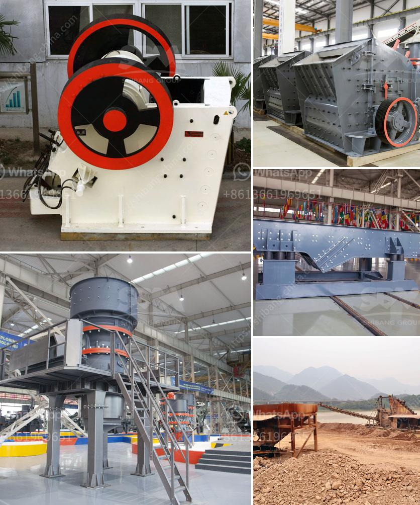

<h3>portable stone crusher</h3>
Portable stone crusher, a wheeled-mounted crushing machine, is a perfect machine for processing concrete waste because of its strong flexibility. Concrete recycling manufacturers always know that if they choose to set up a fixed crushing line, they have to pay more time, money for labor and transportation. portable concrete crushers for recycling blocks A portable crusher can load various fixed crusher machines like fixed jaw crusher, impact rock crusher, hydraulic cone crusher, etc. Therefore, it is a mobile crushing plant integrating crushing equipment, conveyor, and power control equipment. It can last for 20,000 hours under difficult conditions while 30,000 hours under normal conditions, and then needs to be overhauled so that its service life can be extended. 80%-100% of all components could be repaired and recovered or replaced with new wear parts if necessary.

Portable stone crusher equipped with wheeled base is ideal for primary crushing needs and acts as a stand-alone unit for secondary and tertiary crushing applications. Portable stone crusher can be easily adjusted to suit the crushing application by choosing feeding to crusher or feeding to screen options. Reliable performance and convenient maintenance Portable crushing plants adapt excellent quality crusher, screen and feeder made from Shanghai Joyal Mining, yet the quality is stable and reliable. Normal belt conveyor can be used for conveyance of material, which is of mature technology, simply operation, easy maintenance, and low investment.

Portable stone crusher provides a new field of business opportunities for contractors, quarry operators, recycling and mining applications. It offers high efficient and low cost project plan without environment limit for the client.Portable type series mobile crusher is a new type of stone crushing equipment, which expands the concept field in coarse crushing and fine crushing. Based on the client’s requirements, it puts the problem which the crushing place, surroundings brought as the priority work. This series mobile crusher really supply simpler, higher efficient, lower cost machines for clients.

The excellent performance of the mobile jaw crusher is achieved through several unique features such as higher crushing ratio, optimized engineering, and easy adjustment. The jaw crushers are equipped with a proven, rugged and fast wedge-setting adjustment system and available as manual or hydraulic alternatives. Portable Impact Crusher The impact crushers are based upon more than 40 years of experience with the impact method. We offer a complete range of impact crushers for stationary, semi-mobile fully mobile applications in both primary and secondary crushing.Combining high capacity, large feed size, and compact transport dimensions, the mobile impact crusher machine complements the proven and comprehensive product line of mobile crushing plants.

Portable cone crusher designed for the hardest feed materials, the cone crusher Series combine extremely high performance with low total cost. Long-lasting wear parts are provided reducing operational cost even further, which ensures the highest possible functionality and reliability without any compromises. Portable Limestone Crushing Line limestone crusher portable Portable limestone crushing systems,limestone crusher price Peru Portable limestone crushing plant is the major crushing equipment in limestone quarry.

In conclusion, the portable stone crusher machine is ideally suited to meet the diverse needs of the contractor and quarry operators. The portable stone crusher machine has a positive feedback from customers. It provides a new field of business opportunities for contractors, quarry operators, recycling and mining applications. It offers high efficient and low cost project plan without environment limit for the client.
<h3>Contact us</h3><ul><li><strong>Whatsapp:&nbsp;<a href="https://wa.me/8613661969651">+8613661969651</a></strong></li><li><a href="https://swt.shibang-china.com/?git&amp;zhl&amp;portable stone crusher"><strong>Online Service(chat now)</strong></a></li></ul><h3>Related</h3><ul><li><a href='used granite machines for sale cone crusher stone crusher.md'>used granite machines for sale cone crusher stone crusher</a></li><li><a href='ball mill diagram manufacturers in bangalore.md'>ball mill diagram manufacturers in bangalore</a></li><li><a href='cement plant production line.md'>cement plant production line</a></li><li><a href='purity chura crushing machine.md'>purity chura crushing machine</a></li><li><a href='clay grinder machine kerala.md'>clay grinder machine kerala</a></li></ul>