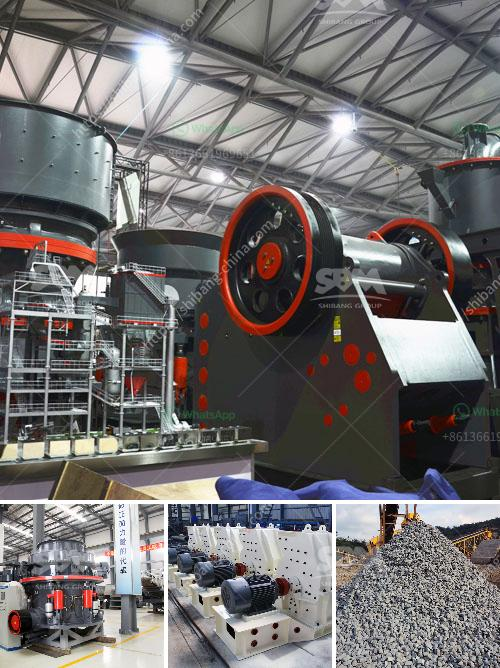

<h3>power draw calculator of ball mill</h3>
A ball mill is a cylindrical drum mounted on the bearings and rotated by thrusted and support wheels. It is used extensively in grinding and mixing processes that require a high level of energy input to obtain the desired product size.

The power draw calculator of a ball mill is a crucial instrumentality used to assess the efficiency and effectiveness of the mill in terms of operation duration, energy consumption, and other factors. The power draw calculation formula of a ball mill relies on multiple parameters, such as motor power, balls weight, and material properties, to determine the total power consumption of the mill during a grinding process.

The motor power input in kilowatts (kW) is a key parameter for calculating the power draw of a ball mill. It is determined by the electrical power supplied to the motor, which is measured in amperes and multiplied by the voltage. The higher the motor power, the more energy is consumed by the mill. This is because significant power is needed to rotate the mill and the grinding media inside it, which crushes and grinds the material to the desired size.

Another crucial parameter is the weight of the grinding balls or media in the mill. These balls are responsible for the crushing and grinding action of the material. To calculate the power draw, the weight of the balls in kilograms (kg) is multiplied by the gravitational constant (9.8 m/s^2) and the height of the mill chamber (in meters). This provides an estimate of how much force is exerted on the material inside the mill, which requires energy input.

The material properties, such as the density and hardness, also play a significant role in determining the power draw of a ball mill. The density of the material in kilograms per cubic meter (kg/m^3) is used to calculate the weight of the material inside the mill. The hardness of the material is essential in estimating the resistance encountered during the grinding process, which affects the total power consumption.

Once all the necessary parameters are obtained, the power draw calculator of a ball mill can be used to determine the total power consumption during a grinding operation. The power draw is expressed in kilowatts (kW) and represents the energy consumption per unit time. This information is crucial for assessing the overall efficiency and effectiveness of the mill, as well as for optimizing the grinding process.

Knowing the power draw of a ball mill enables operators and engineers to make informed decisions and adjustments to improve the efficiency of the process. By monitoring the power consumption, it is possible to identify any inefficiency or potential issues that may require attention, such as worn out grinding media or excessive material feed rate. This allows for proactive maintenance and troubleshooting, resulting in better performance and longer lifespan of the equipment.

In conclusion, the power draw calculator of a ball mill is a valuable tool for assessing the performance of the mill and optimizing its energy consumption. By considering various parameters, such as motor power, balls weight, and material properties, operators and engineers can make informed decisions to improve the efficiency of the grinding process. This ultimately leads to better productivity, reduced energy consumption, and cost savings.
<h3>Contact us</h3><ul><li><strong>Whatsapp:&nbsp;<a href="https://wa.me/8613661969651">+8613661969651</a></strong></li><li><a href="https://swt.shibang-china.com/?git&amp;zhl&amp;power draw calculator of ball mill"><strong>Online Service(chat now)</strong></a></li></ul><h3>Related</h3><ul><li><a href='jaw crusher machine price.md'>jaw crusher machine price</a></li><li><a href='impact crusher for sale in bulawayo.md'>impact crusher for sale in bulawayo</a></li><li><a href='crusher pirdra crusher puedra.md'>crusher pirdra crusher puedra</a></li><li><a href='iron ore crusher in pakistan.md'>iron ore crusher in pakistan</a></li><li><a href='ball mill iron ore only company.md'>ball mill iron ore only company</a></li></ul>