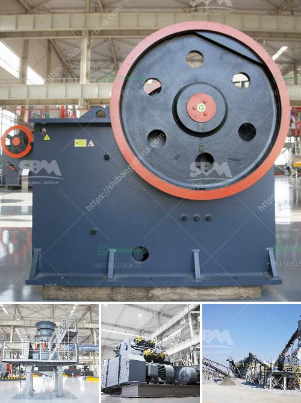

<h3>power of a hammer mill</h3>
A hammer mill is a machine that is utilized in different industries such as agriculture, mining, construction, and many more. It is designed to pulverize a variety of materials into fine particles through a series of repeated strikes with little or no effort. The power of a hammer mill lies in its capacity to grind a wide range of materials into smaller pieces.

One of the key advantages of a hammer mill is its versatility. It can be used for a wide array of applications, including shredding scrap metal, biomass, and many others. It is capable of processing both wet and dry materials, making it suitable for various industries.

When it comes to agriculture, a hammer mill is used to grind and crush grains, seeds, and hay. This allows farmers to produce a more consistent feed for their livestock, resulting in healthier animals. It can also be used to grind various agricultural residues, such as corn stover and sugar cane bagasse, into a fine powder which can be used as biofuel or as a component in animal feed.

In the mining industry, a hammer mill is used to crush ore into smaller pieces for further processing. The mill is commonly used in gold, coal, and limestone processing facilities. It can also be utilized in cement production, allowing the materials to be ground into a finer consistency.

Additionally, a hammer mill is an essential tool in construction. It can be used to crush aggregates, such as gravel and sand, into smaller particles, making it easier to mix with cement or asphalt. This ensures better compaction and a more uniform mixture, resulting in higher-quality infrastructure.

Furthermore, a hammer mill is often used in waste management and recycling processes. It can be employed to pulverize various materials, such as glass, rubber, and electronic waste, into smaller particles, making them easier to handle and transport. This enables efficient recycling and reduces the overall waste volume.

In conclusion, the power of a hammer mill lies in its ability to grind a wide range of materials into smaller particles. Its versatility makes it an essential machine in various industries, including agriculture, mining, construction, and waste management. By pulverizing materials, a hammer mill enables efficient processing, resulting in improved product quality and increased sustainability.
<h3>Contact us</h3><ul><li><strong>Whatsapp:&nbsp;<a href="https://wa.me/8613661969651">+8613661969651</a></strong></li><li><a href="https://swt.shibang-china.com/?git&amp;zhl&amp;power of a hammer mill"><strong>Online Service(chat now)</strong></a></li></ul><h3>Related</h3><ul><li><a href='4 inch marble grinder mill.md'>4 inch marble grinder mill</a></li><li><a href='dicalcium phosphate production line.md'>dicalcium phosphate production line</a></li><li><a href='stone stone crusher machine malaysia.md'>stone stone crusher machine malaysia</a></li><li><a href='big stone crusher prices in south africa.md'>big stone crusher prices in south africa</a></li><li><a href='double rollar mill.md'>double rollar mill</a></li></ul>