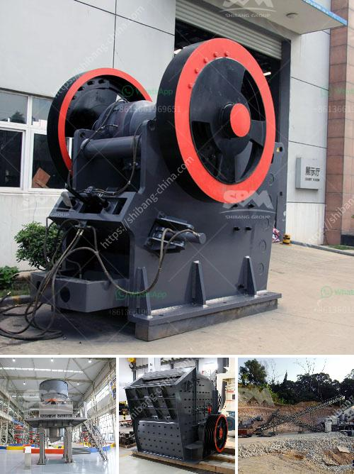

<h3>price a stone crusher in peru</h3>
Stone crusher machines have multiple uses in the mining industry. Its wide range can be seen in the production of building aggregates, manufacturing concrete, and asphalt, among others. These machines are also used for mining purposes, such as crushing ores to extract valuable minerals. Stone crushers are vital pieces of equipment that aid in breaking down larger rocks into smaller, more manageable pieces. 

When considering the price of a stone crusher in Peru, there are several factors to consider, including the brand, model, and specifications of the machine, as well as the usage of the equipment and any additional features or upgrades. Estimating the cost of a stone crusher also depends on its capacity, efficiency, and maintenance requirements. 

Brand and Model: The brand and model of a stone crusher can significantly influence its price. Well-known brands, such as Metso, Sandvik, and Terex, are often associated with higher-priced machines due to their reputation for quality and reliability. Additionally, different models within a brand can also vary in price, depending on their specifications and capabilities.

Capacity: Stone crushers are available in various capacities, ranging from a few tons per hour to hundreds of tons per hour. The capacity directly impacts the price of a stone crusher, as higher capacity means more efficient crushing and more production.

Efficiency: Stone crushers with higher efficiency and performance will have higher prices. These machines can process larger quantities of material in the same amount of time, leading to increased productivity and cost savings in operation.

Maintenance: The maintenance requirements of a stone crusher can also affect its price. Regular maintenance will ensure that the machine operates efficiently and has a longer lifespan. However, it also adds to the overall cost of owning a stone crusher.

Usage: Stone crushers used for mining purposes can have a different price compared to those used for aggregate production or construction applications. Mining stone crushers tend to be larger and more expensive, while crushers used for smaller projects are relatively cheaper.

Additional Features: Stone crushers can come with additional features that can impact their price. These features may include advanced automation systems, hydraulic adjustment mechanisms, and safety features. While these features can enhance the performance and convenience of the machine, they can also increase its price.

In conclusion, the price of a stone crusher in Peru depends on several factors, including the brand, model, capacity, efficiency, maintenance requirements, usage, and any additional features. While the initial investment for a stone crusher may seem high, the savings from efficiently crushing aggregate, ores, and other materials can offset the cost over time. It is essential to carefully consider all these factors before purchasing a stone crusher to ensure that it will meet the needs of the application at an affordable price.
<h3>Contact us</h3><ul><li><strong>Whatsapp:&nbsp;<a href="https://wa.me/8613661969651">+8613661969651</a></strong></li><li><a href="https://swt.shibang-china.com/?git&amp;zhl&amp;price a stone crusher in peru"><strong>Online Service(chat now)</strong></a></li></ul><h3>Related</h3><ul><li><a href='crusher machinery.md'>crusher machinery</a></li><li><a href='conveyor belts in horizontal position.md'>conveyor belts in horizontal position</a></li><li><a href='how to make good with limestone powder.md'>how to make good with limestone powder</a></li><li><a href='stone crusher equipment supplier.md'>stone crusher equipment supplier</a></li><li><a href='mini mobile crusher.md'>mini mobile crusher</a></li></ul>