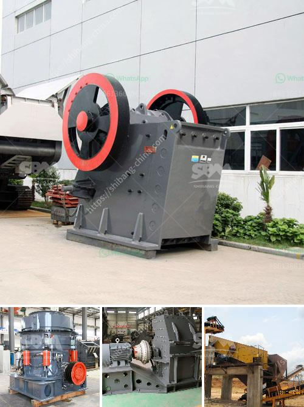

<h3>price china industrial ball mill</h3>
A ball mill is a type of grinder used to grind materials into extremely fine powder for use in mineral dressing processes, paints, pyrotechnics, ceramics, and selective laser sintering. China is known for its strong industrial presence and has therefore been a leading player in the mining equipment industry over the years. With a variety of ball mills available in the market, today we will be discussing the price of industrial ball mill in China.

The price of a ball mill varies depending on the specifications and features of the mill. Larger mills with higher capacity and customizable features tend to be more expensive. On average, the prices range from around $2,000 to $30,000. Smaller mills with standard features and lower capacity are generally cheaper, while larger mills with advanced features and higher capacity can cost significantly more.

It is important to consider the specific requirements of your application before purchasing a ball mill. Factors such as material type, required size reduction, throughput capacity, and desired end-product fineness play a significant role in determining the suitable mill for your needs. Additionally, the quality and reputation of the manufacturer should also be taken into account.

China has established itself as a global manufacturing hub, offering a wide range of industrial products at competitive prices. This has also been reflected in the ball mill market, where China has become a leading player. The competitive pricing of Chinese ball mills is attributed to several factors.

Firstly, China has a vast network of raw material suppliers, allowing manufacturers to acquire the necessary materials at a lower cost. This helps to reduce the overall production cost and subsequently contributes to offering competitive prices to customers. Additionally, the presence of numerous manufacturers in China has fostered a competitive environment, forcing companies to offer their products at competitive prices.

Furthermore, China has invested heavily in its manufacturing capabilities, ensuring efficient production processes and high-quality standards. The use of advanced technologies and modern production techniques enables Chinese manufacturers to produce ball mills that meet international standards while keeping the prices competitive.

It is worth mentioning that the price of an industrial ball mill in China can vary depending on several factors, including the size of the mill, the manufacturer, and the specific features required. Therefore, it is advisable to obtain multiple quotes from different manufacturers to compare prices and ensure you are getting the best value for your investment.

In conclusion, the price of an industrial ball mill in China varies depending on the size, capacity, and features of the mill. China's strong industrial presence and efficient manufacturing capabilities have allowed its manufacturers to offer competitive prices to international buyers. However, it is important to carefully evaluate the specifications and features of the mill before making a purchase to ensure it meets your specific requirements.
<h3>Contact us</h3><ul><li><strong>Whatsapp:&nbsp;<a href="https://wa.me/8613661969651">+8613661969651</a></strong></li><li><a href="https://swt.shibang-china.com/?git&amp;zhl&amp;price china industrial ball mill"><strong>Online Service(chat now)</strong></a></li></ul><h3>Related</h3><ul><li><a href='chrome crusher for sale south africa.md'>chrome crusher for sale south africa</a></li><li><a href='crusher crusher run for sale in sabah.md'>crusher crusher run for sale in sabah</a></li><li><a href='how to make a vibrating screen for sale.md'>how to make a vibrating screen for sale</a></li><li><a href='slag processing machine in australia.md'>slag processing machine in australia</a></li><li><a href='hammer mill zimbabwe.md'>hammer mill zimbabwe</a></li></ul>