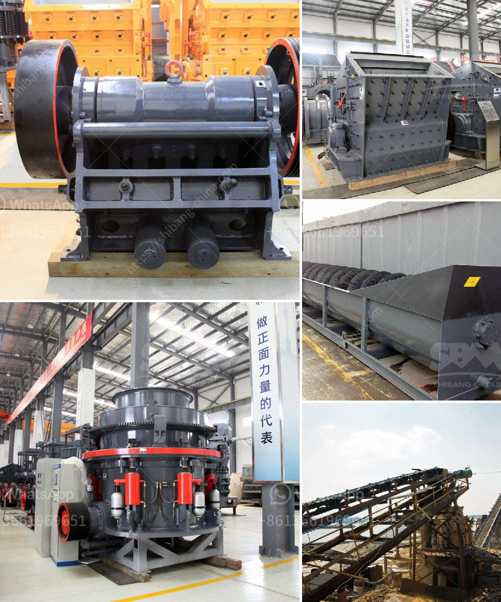

<h3>price limestone rock crusher</h3>
Limestone is a sedimentary rock that is primarily used as a building material and as a raw material for manufacturing concrete. It is abundant and widely available, making it an affordable option for various construction projects. However, the process of mining and crushing limestone into usable aggregate requires heavy machinery, such as rock crushers.

A limestone rock crusher is a machine designed to reduce large rocks into smaller pieces or gravel. It can also be used to rock gypsum, shale, claystone, coal, and other materials. The crushing process involves the use of hammers or blow bars to break the limestone rock into fragments that are then sorted by size and used in various applications, such as concrete production, road base, and landscaping.

The price of a limestone rock crusher depends on the capacity and the features of the machine. Generally, smaller crushers are cheaper than larger ones, and crushers with additional features, such as screens and conveyors, tend to be more expensive. The cost can range from a few thousand dollars for a small crusher to several hundred thousand dollars for a high-capacity machine.

When purchasing a limestone rock crusher, it is essential to consider the specific needs of the project. Factors such as the required output size, the production capacity, and the material properties should be taken into account. It is also important to compare prices from different suppliers and manufacturers to ensure getting the best value for money.

In addition to the upfront cost of purchasing a limestone rock crusher, it is important to consider the long-term costs of operating and maintaining the machine. These costs include energy consumption, spare parts, and repairs. Some manufacturers may offer warranties or service packages that can help reduce these expenses.

Investing in a limestone rock crusher can provide significant benefits in terms of cost savings, efficiency, and productivity. By crushing limestone rock on site, it eliminates the need for transportation and reduces the environmental impact associated with quarrying and hauling aggregate. Furthermore, using a rock crusher allows for precise customization of aggregate sizes, which can result in more efficient construction and improved quality of the final product.

In conclusion, the price of a limestone rock crusher depends on various factors, including the capacity, features, and supplier. It is crucial to assess the specific requirements of the project and consider both the upfront and long-term costs. By making an informed decision, it is possible to find a limestone rock crusher that meets the needs of the project and offers a good return on investment.
<h3>Contact us</h3><ul><li><strong>Whatsapp:&nbsp;<a href="https://wa.me/8613661969651">+8613661969651</a></strong></li><li><a href="https://swt.shibang-china.com/?git&amp;zhl&amp;price limestone rock crusher"><strong>Online Service(chat now)</strong></a></li></ul><h3>Related</h3><ul><li><a href='stone stone crusher machine malaysia.md'>stone stone crusher machine malaysia</a></li><li><a href='list of machineries for marble processing plants.md'>list of machineries for marble processing plants</a></li><li><a href='i want to buy china raymond grinding mill.md'>i want to buy china raymond grinding mill</a></li><li><a href='jaw crushers manufacturers europe.md'>jaw crushers manufacturers europe</a></li><li><a href='continuous or discontinuous ball mills.md'>continuous or discontinuous ball mills</a></li></ul>