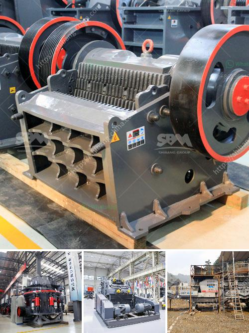

<h3>price list coal crusher plant 1500 ton hour</h3>
Coal is one of the most abundant resources in the world, with over four trillion tons of reserves, which are found in almost every country. The mining and utilization of this fossil fuel have been essential for the development of several industries, including power generation, steel production, and cement manufacturing. As a crucial part of coal processing, a coal crusher plant is instrumental in reducing the size of the mined material, making it suitable for various industrial applications.

A coal crusher plant 1500 ton hour utilizes jaw crushers and roller crushers to crush the mined raw coal into tiny granules for subsequent combustion in the boiler. The process is efficient and reduces the overall cost of coal extraction, thus making it cheaper for end-users. Also, the plant generates minimal emissions, making it an environmentally friendly option, especially when compared to coal-fired power plants that produce large amounts of greenhouse gases.

The price list for a coal crusher plant 1500 ton hour includes vibrating feeder, jaw crusher, rotary crusher, cone crusher, and vibrating screen. The production capacity is between 10-1000 ton/hour. You can choose the particular production capacity according to your detailed requirement.

It is worth noting that these prices are subject to change. Factors such as market demand, customization requirements, and the brand value of the manufacturer can significantly influence the final price. Therefore, it is advisable to contact the manufacturer directly for an accurate quotation.

When purchasing a coal crusher plant 1500 ton hour, it is recommended to consider factors such as the reputation of the manufacturer, the after-sales service provided, and the equipment quality. Comparing prices from multiple suppliers will help you find the best option that suits your budget and requirements.

Overall, a coal crusher plant 1500 ton hour is essential for the preparation of coal for various industries. With its low production cost, environmental benefits, and high efficiency, it provides an excellent solution for coal processing. Keeping in mind the factors mentioned above, investing in a coal crusher plant can be a profitable venture for both large-scale industries and small-scale entrepreneurs.
<h3>Contact us</h3><ul><li><strong>Whatsapp:&nbsp;<a href="https://wa.me/8613661969651">+8613661969651</a></strong></li><li><a href="https://swt.shibang-china.com/?git&amp;zhl&amp;price list coal crusher plant 1500 ton hour"><strong>Online Service(chat now)</strong></a></li></ul><h3>Related</h3><ul><li><a href='sell stone crusher.md'>sell stone crusher</a></li><li><a href='marble crusher manufacturer.md'>marble crusher manufacturer</a></li><li><a href='coal screen plant for hire in south africa.md'>coal screen plant for hire in south africa</a></li><li><a href='used mobile screens and crusher in africa.md'>used mobile screens and crusher in africa</a></li><li><a href='marble quarry mining crusher in sudan.md'>marble quarry mining crusher in sudan</a></li></ul>