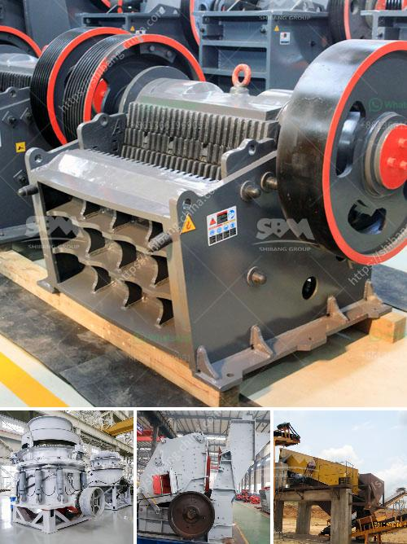

<h3>price list of grinding equipment for sale</h3>
If you are in the market for grinding equipment, whether it is for professional use or personal DIY projects, finding the right equipment at the right price can make all the difference. Grinding equipment is essential for tasks such as shaping, cutting, and smoothing various materials, such as metal, wood, or concrete.

Here, we present a price list of grinding equipment for sale, ensuring you have an idea of the budget you may need to allocate for your desired grinding equipment.

1. Angle Grinder: These versatile tools are widely used in construction and metalworking. The price range for angle grinders varies greatly depending on the brand and power. Smaller, basic models may start at around $30, while high-end professional-grade ones can go up to $150 or more.

2. Bench Grinder: Ideal for sharpening blades and shaping metals, bench grinders come in different sizes and power options. Smaller, entry-level models can be found for as low as $50, but heavy-duty industrial-grade models can reach prices upwards of $300.

3. Surface Grinder: Used for precision grinding, surface grinders often come with advanced features, including automated controls and varying speed options. These tend to be pricier, with smaller benchtop models starting around $500 and larger industrial models easily surpassing $3,000.

4. Concrete Grinder: For those working with concrete surfaces, a concrete grinder is a must-have tool. Entry-level handheld models can be found for around $100, while heavy-duty walk-behind models may range from $1,000 to $5,000 or more.

5. Die Grinder: These compact and lightweight grinders are perfect for detailed and intricate work. Prices for die grinders can start as low as $30 for basic models, while high-quality, professional-grade models can go up to $200.

It is important to remember that these price ranges are estimates and can fluctuate depending on factors such as brand, features, and additional accessories included. It is recommended to compare prices, read reviews, and consider your specific needs to make an informed decision.

In conclusion, finding a grinding equipment that fits within your budget and meets your needs is crucial. Whether you are a professional or a hobbyist, investing in quality grinding equipment will ensure efficient and precise work, making it a worthwhile investment.
<h3>Contact us</h3><ul><li><strong>Whatsapp:&nbsp;<a href="https://wa.me/8613661969651">+8613661969651</a></strong></li><li><a href="https://swt.shibang-china.com/?git&amp;zhl&amp;price list of grinding equipment for sale"><strong>Online Service(chat now)</strong></a></li></ul><h3>Related</h3><ul><li><a href='crusher in argentina stone crusher.md'>crusher in argentina stone crusher</a></li><li><a href='quartz making process.md'>quartz making process</a></li><li><a href='crusher for rent in malaysia.md'>crusher for rent in malaysia</a></li><li><a href='ball mill for lead processing companies list.md'>ball mill for lead processing companies list</a></li><li><a href='quartz ball mill.md'>quartz ball mill</a></li></ul>