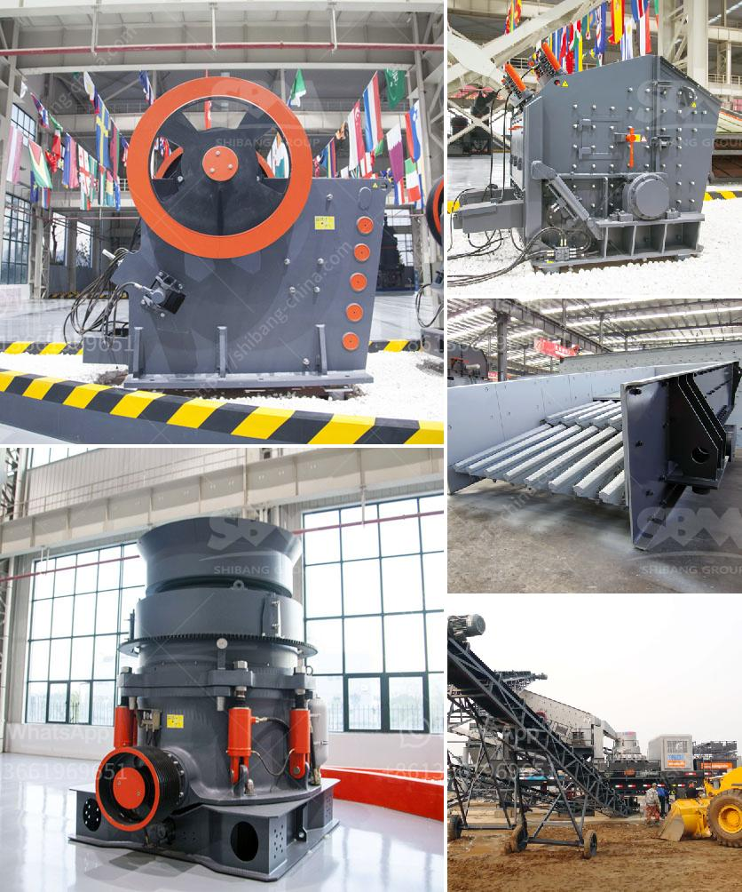

<h3>price list of stone crusher in india</h3>
Stone crusher machine has lots of types, such as jaw crusher, impact crusher, cone crusher, VSI Crusher, Hammer Crusher. Impact Factor of Stone Crusher Machine Price. Stone crusher price mainly depends on the following five points: Brand, the brand is the most important factor affecting the price. Different brands of stone crusher price varies greatly due to brand awareness, as it relates to service issues, the brand bigger and often more comprehensive after-sales service to ensure more comprehensive quote will be. Different types of equipment. Different types of mines are not the same hardness and compressive strength, you need to select the corresponding stone crusher, stone crusher different price naturally different. Technical content. The technical content is the key to select the device, but also an important manifestation of the crusher price. The higher technical parameters, the higher the cost, maintenance more convenient, prices are often becomes. Our Stone Crusher Machine Price in India. Because of the rich mineral resources, Indian stone crusher machine sales competition has been very intense , but our stone crusher machines in India has been selling well, because the premise of the same quality, our price is relatively low, because we in India have specialized factories can manufacture directly lost a large part of the transportation costs. And our experts constantly developing new technologies, with the most advanced technology to replace unnecessary parts and reduce costs. If you want to learn more about different kinds of stone crusher machine price in india, Just contact us!
<h3>Contact us</h3><ul><li><strong>Whatsapp:&nbsp;<a href="https://wa.me/8613661969651">+8613661969651</a></strong></li><li><a href="https://swt.shibang-china.com/?git&amp;zhl&amp;price list of stone crusher in india"><strong>Online Service(chat now)</strong></a></li></ul><h3>Related</h3><ul><li><a href='screening and crushing solutions.md'>screening and crushing solutions</a></li><li><a href='crusher machine manufacturers in india.md'>crusher machine manufacturers in india</a></li><li><a href='rock crusher for crushing balsalt stone.md'>rock crusher for crushing balsalt stone</a></li><li><a href='basalt stone processing plant.md'>basalt stone processing plant</a></li><li><a href='ball mill for size reduct.md'>ball mill for size reduct</a></li></ul>