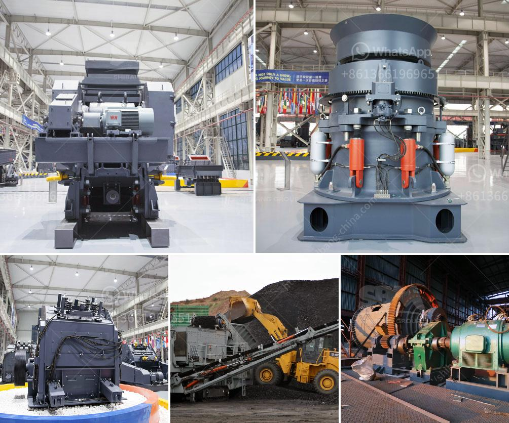

<h3>price list stone crusher machine sri lanka</h3>
Stone crusher machine is a technologically advanced machine that is used for breaking solid and hard materials into smaller pieces. The machine is commonly used for primary crushing of various hardness stones. The crusher is highly adaptable and can be used in a variety of working conditions. Our jaw crusher equipment comes in a range of sizes and capacities to meet your project requirements.

When it comes to purchasing a stone crusher machine, most of the people are concerned about its price. Price plays a vital role in the overall selection of the machine. Our stone crusher machine price list in Sri Lanka is competitive and affordable. We offer the best prices on the market, ensuring customer satisfaction.

Our stone crusher machine is ideal for construction projects and can be used in various applications. Our jaw crusher machine is particularly suitable for crushing hard and abrasive materials such as granite, basalt, limestone, quartzite, and river gravel. It is widely used in the mining industry, cement production, and road construction industry.

In addition to its high performance, our stone crusher machine is also energy-efficient. It consumes less energy compared to other machines on the market, resulting in lower operational costs. The machine is designed to be easy to operate, reducing downtime and increasing productivity.

We offer a range of stone crusher machines with different specifications to meet the diverse needs of our customers. Our machines are available in different models with varying capacities, ranging from 15 tons per hour to 300 tons per hour. Whether you are a small-scale contractor or a large construction company, we can provide a suitable machine for your needs.

In conclusion, our stone crusher machine offers high performance, affordability, and efficiency. With a competitive price, it is the perfect choice for any construction project. Contact us now for more information and to get a free quote.
<h3>Contact us</h3><ul><li><strong>Whatsapp:&nbsp;<a href="https://wa.me/8613661969651">+8613661969651</a></strong></li><li><a href="https://swt.shibang-china.com/?git&amp;zhl&amp;price list stone crusher machine sri lanka"><strong>Online Service(chat now)</strong></a></li></ul><h3>Related</h3><ul><li><a href='roll mill manufacturere in mumbai.md'>roll mill manufacturere in mumbai</a></li><li><a href='used cone crushers zambia.md'>used cone crushers zambia</a></li><li><a href='advance stone agregate crusher equipments.md'>advance stone agregate crusher equipments</a></li><li><a href='250 mesh hammer mill.md'>250 mesh hammer mill</a></li><li><a href='mobile ball mill for small scale mining.md'>mobile ball mill for small scale mining</a></li></ul>