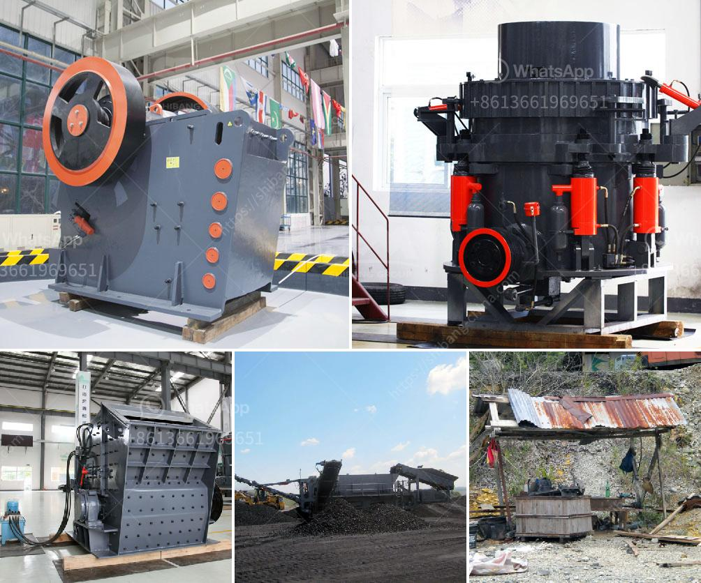

<h3>price of a rock crusher</h3>
The price of a rock crusher can vary greatly depending on the size, weight, and specifications of the model range. Generally speaking, most rock crushers will cost between $10,000 and $30,000. The price will also depend on the kind of rock being crushed. Some rocks, such as granite and limestone, are harder and more costly to crush than others. 

When considering the price of a rock crusher, it's important to also take into account the operating costs. This includes factors such as fuel consumption, maintenance, and repairs. While initial purchase price is important, it's equally vital to understand the long-term expenses associated with running and maintaining the crusher.

Additionally, the capacity of the rock crusher can impact its price. Larger crushers with higher crushing capacity will generally be more expensive than smaller ones. This is because larger crushers require more powerful motors and heavier construction to handle bigger rocks.

Furthermore, the brand and reputation of the manufacturer can also influence the price of a rock crusher. Well-known and established manufacturers often charge more for their products due to the trust and quality they have built over time.

Considering all these factors, it's advisable to research and compare prices from different manufacturers to find the best value for your needs. It's important to strike a balance between price, quality, and efficiency when choosing the right rock crusher for your requirements.
<h3>Contact us</h3><ul><li><strong>Whatsapp:&nbsp;<a href="https://wa.me/8613661969651">+8613661969651</a></strong></li><li><a href="https://swt.shibang-china.com/?git&amp;zhl&amp;price of a rock crusher"><strong>Online Service(chat now)</strong></a></li></ul><h3>Related</h3><ul><li><a href='concrete crusher for sale.md'>concrete crusher for sale</a></li><li><a href='kaolin stone crusher.md'>kaolin stone crusher</a></li><li><a href='small scale iron ore processing plants sale.md'>small scale iron ore processing plants sale</a></li><li><a href='quote for sand making machine.md'>quote for sand making machine</a></li><li><a href='how to make lime powder.md'>how to make lime powder</a></li></ul>