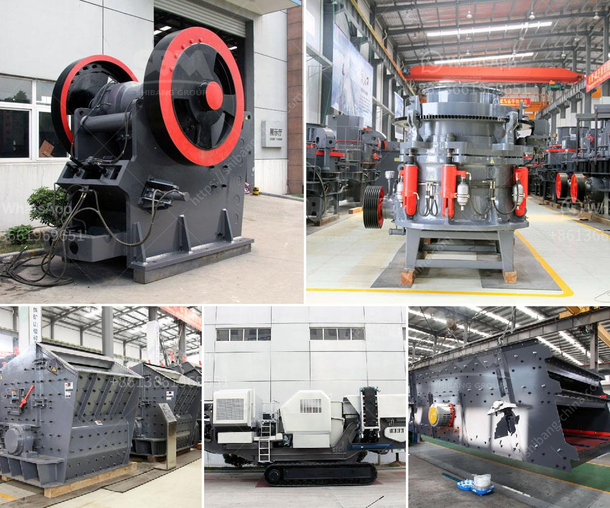

<h3>price of ballast per ton in kenya</h3>
The fluctuating and escalating prices of ballast (a construction material made from crushed stones) is a common issue in Kenya. Prices in the country are highly dependent on the availability of ballast within and outside the country. In recent years, the cost of ballast per ton has been on the rise making it a significant factor in construction costs.

Ballast is an essential material used in the construction of roads, railways, and buildings. It provides a solid foundation and stability to structures. It is a critical component in the construction industry, and the demand for it remains consistently high.

One of the factors attributing to the price fluctuation is the availability of ballast. Traditionally, ballast was sourced from riverbeds. However, due to environmental concerns and strict regulations, river mining has been limited, reducing the availability of river sand. This scarcity has led to an increase in prices.

Another factor is the infrastructure development in the country. Kenya has been experiencing rapid urbanization and an increased demand for better roads and railways. As such, the demand for ballast has gone up significantly, putting pressure on suppliers who struggle to meet the demand. The limited supply increases the cost of ballast.

The quality of ballast is also a contributing factor to price variations. There are different grades of ballast depending on the intended use. High-quality ballast, which is more durable and effective, tends to be more expensive compared to lower-quality alternatives. As construction companies seek to ensure long-lasting infrastructures, they are willing to pay a premium for quality ballast.

Transportation costs also play a role in determining the price of ballast. Kenya has vast regions where ballast is not readily available, thus requiring transportation from distant areas. The longer the distance, the higher the transportation cost, which is passed on to the consumer. Additionally, factors such as fuel prices and road conditions further inflate the cost of transportation, thus affecting the final price of the ballast.

Given the rising costs, industry players are constantly seeking alternatives to traditional ballasting methods. Recycling and reusing construction materials, such as crushed concrete, can be an alternative. These materials can provide a similar function to conventional ballast but at a lower cost. However, these alternatives are not yet widely adopted due to the need for quality assurance and standardization.

To address the issue of fluctuating ballast prices, the Kenyan government can play a role. By ensuring a sustainable and regulated mining process for ballast, the availability can be improved, stabilizing the prices. The government can also incentivize the use of alternative materials to relieve pressure on traditional ballast supply.

In conclusion, the price of ballast per ton in Kenya has seen significant fluctuations in recent years. Factors such as the availability of ballast, infrastructure development, quality requirements, transportation costs, environmental regulations, and alternatives to traditional ballast play a role in determining these prices. Stakeholders in the construction industry, in collaboration with the government, need to explore viable options to mitigate the effects of price fluctuations and ensure a stable supply of affordable ballast.
<h3>Contact us</h3><ul><li><strong>Whatsapp:&nbsp;<a href="https://wa.me/8613661969651">+8613661969651</a></strong></li><li><a href="https://swt.shibang-china.com/?git&amp;zhl&amp;price of ballast per ton in kenya"><strong>Online Service(chat now)</strong></a></li></ul><h3>Related</h3><ul><li><a href='quartz marble making machine.md'>quartz marble making machine</a></li><li><a href='tonne per hour ball mill gold crushing.md'>tonne per hour ball mill gold crushing</a></li><li><a href='rubber grinder machine in philippines.md'>rubber grinder machine in philippines</a></li><li><a href='two roll mill machine.md'>two roll mill machine</a></li><li><a href='coltan milling equipment in south africa.md'>coltan milling equipment in south africa</a></li></ul>