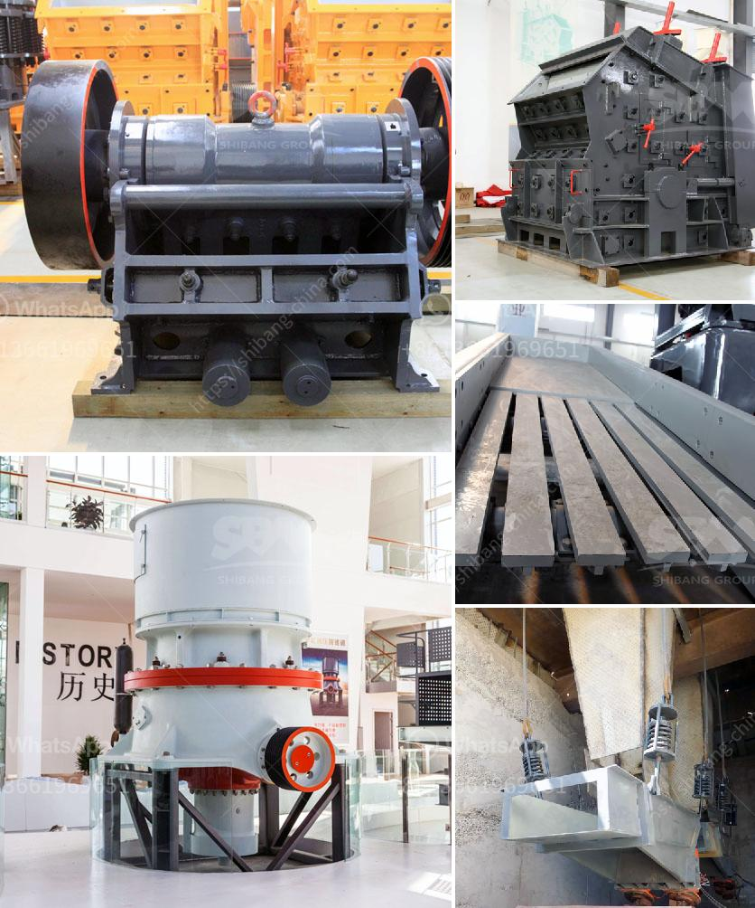

<h3>price of cone crusher</h3>
When searching for the best cone crusher price, a myriad of factors are at play. The price of these machines is dictated by numerous elements, including the quality and precision requirements, the production capacity, maintenance needs, and the scarcity of spare parts. To understand the price of a cone crusher better, one must consider all of these variables.

Firstly, the overall quality and precision requirements greatly impact the price. Cone crushers are precision machines that require a high level of attention to detail during manufacturing. Any small defect or imperfection can impact the crusher’s performance and reliability, leading to higher maintenance costs in the long run. Manufacturers who prioritize quality often demand a higher price for their products.

Secondly, the production capacity is another key contributing factor to the cone crusher price. In general, machines with higher production capacities tend to be pricier. This is because they require stronger and more durable components to handle larger volumes of material. Furthermore, crushers with higher capacities usually have more advanced features to enhance efficiency, leading to a higher overall cost.

Maintenance needs are also an important consideration. Crushers that require less maintenance, such as those with automated lubrication systems or easy-to-replace wear parts, are usually priced higher. These added features help reduce downtime, save on maintenance costs, and increase the machine’s lifespan. It is essential to evaluate the maintenance requirements when comparing prices.

Finally, the scarcity of spare parts influences the price. Some crushers may require specific spare parts that are not readily available, resulting in longer delivery times and higher costs. This can be a determining factor, especially in remote areas where spare part accessibility may be limited. It is crucial to evaluate the availability and cost of spare parts before purchasing a cone crusher.

In conclusion, the price of a cone crusher is a multifaceted result of various factors. Quality, precision requirements, production capacity, maintenance needs, and spare part scarcity all contribute to the final price tag. It is essential to understand these variables and carefully evaluate them when searching for the best cone crusher suited for specific needs.
<h3>Contact us</h3><ul><li><strong>Whatsapp:&nbsp;<a href="https://wa.me/8613661969651">+8613661969651</a></strong></li><li><a href="https://swt.shibang-china.com/?git&amp;zhl&amp;price of cone crusher"><strong>Online Service(chat now)</strong></a></li></ul><h3>Related</h3><ul><li><a href='mtw series trapezium mill.md'>mtw series trapezium mill</a></li><li><a href='continuous or discontinuous ball mills.md'>continuous or discontinuous ball mills</a></li><li><a href='crusher for sale egypt.md'>crusher for sale egypt</a></li><li><a href='rock crusher for chromium or chromite ore.md'>rock crusher for chromium or chromite ore</a></li><li><a href='gypsum board machinery turkey manufacturers.md'>gypsum board machinery turkey manufacturers</a></li></ul>