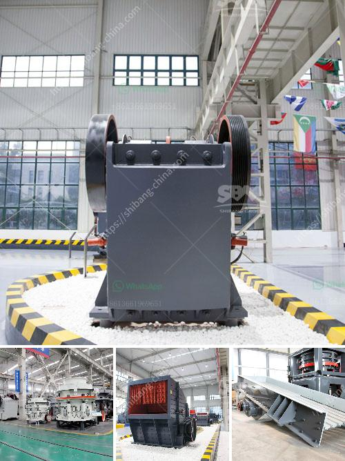

<h3>price of crushers of gravel</h3>
Gravel is an essential material used in the construction industry for various purposes such as making concrete, road bedding, and drainage systems. To obtain gravel, crushers are used to break down large rocks into smaller pieces. However, the price of crushers for gravel can vary greatly depending on the specifications of the machine and the size of the rocks being crushed.

The price of crushers for gravel varies depending on the type of machine and the capacity of production. For instance, jaw crushers are more suitable for handling smaller sizes of rocks, while cone crushers are used for large rocks and stones. Some crushers are integrated with a vibrating screening deck, making it easier to separate the desired product from the unwanted materials.

In terms of capacity, mobile crushers can be used depending on the scale of the project. Mobile crushers are equipped with a remote control system, allowing them to be easily operated from a distance. This flexibility makes them highly convenient for construction sites where the gravel demand may vary.

Price of crushers also depends on the brand and condition of the machine. The used crushers may have higher or lower prices, but quality does not always depend on the price. It is important to research and compare the specifications and features of different crushers in order to make an informed decision.

In conclusion, the price of crushers for gravel can range from a few thousand dollars to hundreds of thousands of dollars depending on the specifications and the manufacturer. It is important to consider factors such as capacity, mobility, and brand reputation when choosing a crusher. Investing in a high-quality crusher can result in higher productivity, longer operational life, and reduced maintenance costs in the long run.
<h3>Contact us</h3><ul><li><strong>Whatsapp:&nbsp;<a href="https://wa.me/8613661969651">+8613661969651</a></strong></li><li><a href="https://swt.shibang-china.com/?git&amp;zhl&amp;price of crushers of gravel"><strong>Online Service(chat now)</strong></a></li></ul><h3>Related</h3><ul><li><a href='quartz marble making machine.md'>quartz marble making machine</a></li><li><a href='manganese ore jaw crusher south africa.md'>manganese ore jaw crusher south africa</a></li><li><a href='quarrying business plant in nigeria.md'>quarrying business plant in nigeria</a></li><li><a href='crusher for sale in malaysia.md'>crusher for sale in malaysia</a></li><li><a href='turnkey project for gypsum board manufacturing plant.md'>turnkey project for gypsum board manufacturing plant</a></li></ul>