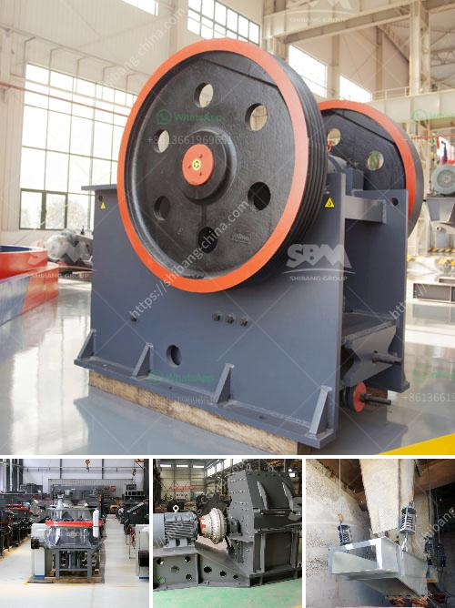

<h3>price of granite jaw crusher</h3>
The granite jaw crusher is a widely used crushing equipment for crushing various ores and bulk materials. It can crush materials with compressive strength not exceeding 320Mpa, and the particle size is less than 500mm. It is characterized by large crushing ratio, simple structure, reliable operation, easy maintenance, low operating costs, and economic use. Therefore, the price of granite jaw crusher is a concern for many customers.

The price of granite jaw crusher is affected by many factors. The following factors are the main factors:

1. Model. The model of the granite jaw crusher is an important factor affecting the price. Different models have different processing capacities, motor powers, and equipment materials, and the prices are naturally different.

2. Manufacturing materials. The materials used in the production of granite jaw crushers are mainly high-manganese steel, high-chromium cast iron, and high-strength alloy steel. The material of the equipment directly affects the performance and price of the equipment. High-quality raw materials can guarantee the reliability and durability of the granite jaw crusher, so the price will be relatively higher.

3. Production technology. The production technology of granite jaw crushers includes a series of processes such as casting, heat treatment, and machining. Different manufacturers have different production technologies and processes, which will affect the quality and price of the equipment. Manufacturers that adopt advanced production technology and processes usually have higher prices.

4. Manufacturer. The price of granite jaw crusher is also affected by the manufacturer. Different manufacturers have different production costs, labor costs, and profit margins, so the price will vary. Well-known manufacturers generally have higher prices, but the quality and after-sales service are guaranteed.

5. Market supply and demand. The supply and demand relationship of granite jaw crushers in the market also affects prices. When the market demand is large, the price will increase accordingly. Conversely, when the market demand is small, the price may be lower.

In addition to the above factors, other factors, such as transportation costs, import and export policies, and exchange rates, will also affect the price of granite jaw crushers.

In summary, the price of granite jaw crusher is affected by various factors. Customers should conduct a comprehensive analysis based on their actual needs, budgets, and equipment quality when choosing equipment. It is recommended to select a trustworthy manufacturer, compare prices, and conduct on-site inspections if conditions permit. Only by selecting a suitable and cost-effective granite jaw crusher can customers obtain higher economic benefits in the crushing process.
<h3>Contact us</h3><ul><li><strong>Whatsapp:&nbsp;<a href="https://wa.me/8613661969651">+8613661969651</a></strong></li><li><a href="https://swt.shibang-china.com/?git&amp;zhl&amp;price of granite jaw crusher"><strong>Online Service(chat now)</strong></a></li></ul><h3>Related</h3><ul><li><a href='pebble crushing processing.md'>pebble crushing processing</a></li><li><a href='model of raymound roller mill.md'>model of raymound roller mill</a></li><li><a href='mobile sand washing machine.md'>mobile sand washing machine</a></li><li><a href='coal crushing plant price.md'>coal crushing plant price</a></li><li><a href='china clay processing.md'>china clay processing</a></li></ul>