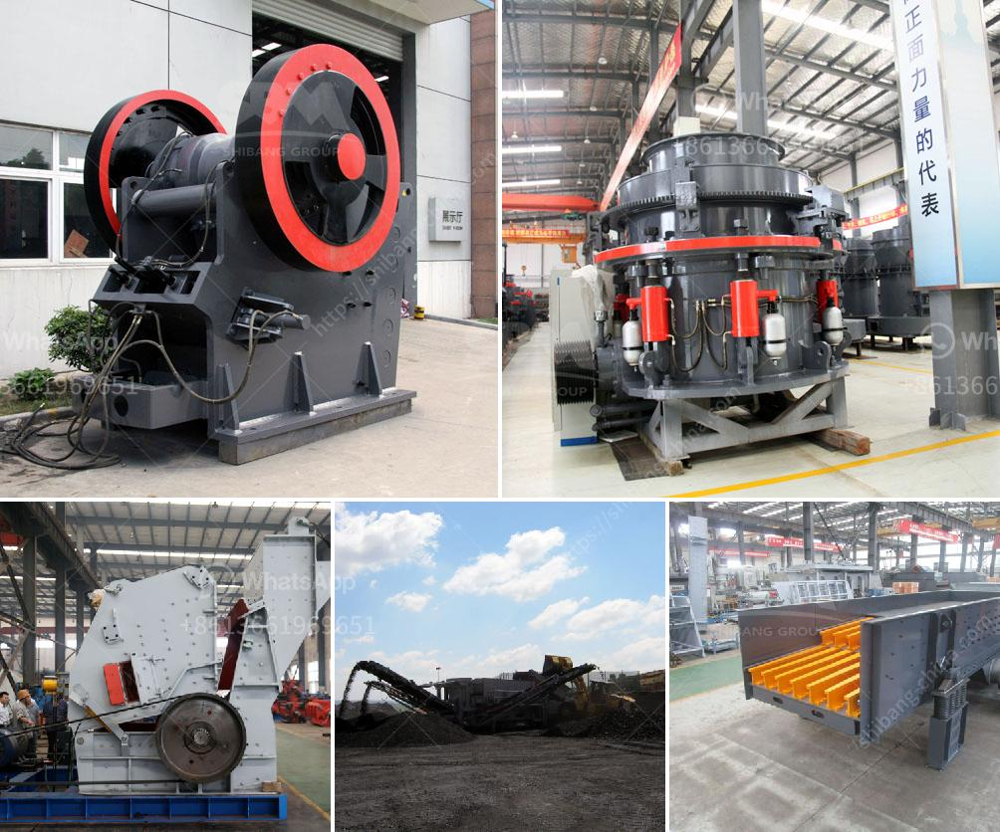

<h3>price of industrial crusher in nigeria</h3>
The price of industrial crusher in Nigeria is influenced by various factors, including the brand, characteristics, specifications, weight and capacity of the equipment. With the ongoing infrastructure construction boom, there is a high demand for industrial explosion crushers. This has resulted in an increase in the prices of industrial aggregate crushers in Nigeria, leading to many potential buyers unable to purchase them.

To address this challenge, several manufacturers and suppliers of crushers in Nigeria are strategically adjusting their price points to attract customers. Most crushers are manufactured with a specific production capacity in mind, ranging from a few hundred kilograms to several tons per hour. Therefore, it is essential for buyers to determine the desired output capacity of the crusher, as this will greatly influence the pricing structure.

Furthermore, the brand reputation and quality of the crusher play a crucial role in determining its price. Well-established brands that have proven track records tend to charge higher prices due to their reliability and durability. On the other hand, lesser-known brands might offer more affordable options, but buyers should conduct adequate research to ensure the quality meets their requirements.

In addition to the price of the industrial crusher itself, buyers must also consider the cost of installation, transportation, and maintenance. These additional expenses can significantly impact the overall cost of the equipment.

To find the best prices for industrial crushers in Nigeria, it is recommended to compare prices from different suppliers and negotiate accordingly. Buyers should also explore options for financing or leasing the equipment, as this can help alleviate the financial burden.

In conclusion, the price of an industrial crusher in Nigeria is influenced by factors such as brand, capacity, and quality. Buyers should conduct thorough market research, compare prices, and negotiate to find the most reasonable and affordable option that meets their requirements.
<h3>Contact us</h3><ul><li><strong>Whatsapp:&nbsp;<a href="https://wa.me/8613661969651">+8613661969651</a></strong></li><li><a href="https://swt.shibang-china.com/?git&amp;zhl&amp;price of industrial crusher in nigeria"><strong>Online Service(chat now)</strong></a></li></ul><h3>Related</h3><ul><li><a href='big stone crusher prices in south africa.md'>big stone crusher prices in south africa</a></li><li><a href='jaw crusher machine cost.md'>jaw crusher machine cost</a></li><li><a href='manganese ore jaw crusher south africa.md'>manganese ore jaw crusher south africa</a></li><li><a href='functions of a mobile crushing plant.md'>functions of a mobile crushing plant</a></li><li><a href='jaw crusher start up procedure.md'>jaw crusher start up procedure</a></li></ul>