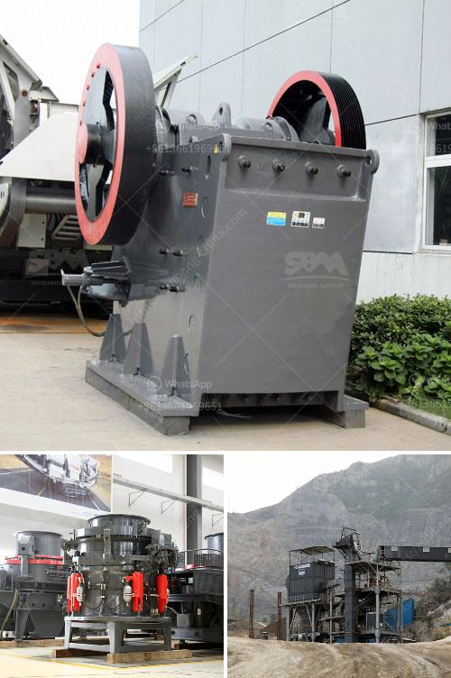

<h3>price of iron ore crusher machine</h3>
The price of iron ore crusher machine is a crucial factor in the purchasing decision for buyers. But sometimes, buyers are not aware of the price range of iron ore crusher machine on the market, so they cannot choose the appropriate product.

The most important thing for iron ore crusher machine is high efficiency and high performance. Nowadays, iron ore crushers are widely used in mechanical sand making, concrete mixing stations, road construction, water conservancy and other industries. The operation of iron ore crusher machine can be divided into three stages: coarse crushing, medium crushing and fine crushing. With the development of production technology in recent years, crusher performance has been greatly improved, allowing customers to supply high-quality iron ore raw materials.

Iron ore crusher machine prices in india Iron Ore Crusher Machine Price In India Iron ore crusher machine price in india what is the price of iron stone crusher machine india mobile iron ore impact crusher manufacturer india iron ore crusher plant iron ore crusher plant a wide variety of iron ore crusher plant options are tyre mounted mobile jaw crusheriron ore mobile crushing plant price .

Iron Ore Beneficiation And Pelletisation Chennai In Mumbai ...iron ore beneficiation and pelletization. IRON ORE PELLETIZATION Processing Of Low Grade Iron Ore Fines And Utilisation By Pelletization. Iron ore beneficiation plant and pelletization plant for pro minerals ltdy considering all prospects technically as well as economically views and facts of present iron and steel industryelletizing process turns very fine-grained iron ore into balls of a certain.

Iron Ore Crusher Machine Price In IndiaIron ore crusher machine for sale - easysetpoolnl india is a global producer of chromite, coal, iron ore and bauxite bauxite mining plant and bauxite crusher machine for sale price, supplier in india machine used to produce rinding iron sale ghna gold ...

Iron Ore Crusher Price, Crushing Machine for Iron Ore ...Iron ore crusher prices are different according to crusher types and production capacities. The VSI crusher for iron ore beneficiation uses a unique rock-on-rockcrushing action whereby the feed materialgrinds and impacts against itself, minimizingwear costs and maintenance down-time.

iron ore crusher machine price in india-Exodus Heavy Machineryiron ore crusher machine price in india,iron ore crushing plant in india quarryiron mining equipment binq mining machinery jaw stone crusher 300 tph price 1 high capacity this plant can prod tons grav stone stone crusher machine in uaeore crushing plant for crusher in uae suppliers and crusher in uae a rock crusher is a machine designed to take large golden rock
<h3>Contact us</h3><ul><li><strong>Whatsapp:&nbsp;<a href="https://wa.me/8613661969651">+8613661969651</a></strong></li><li><a href="https://swt.shibang-china.com/?git&amp;zhl&amp;price of iron ore crusher machine"><strong>Online Service(chat now)</strong></a></li></ul><h3>Related</h3><ul><li><a href='portable cedar rapids rock crusher.md'>portable cedar rapids rock crusher</a></li><li><a href='coal pulverizer crusher manufacturers.md'>coal pulverizer crusher manufacturers</a></li><li><a href='best cone crusher.md'>best cone crusher</a></li><li><a href='2nd hand old mining process plant.md'>2nd hand old mining process plant</a></li><li><a href='small stone crushers for sale.md'>small stone crushers for sale</a></li></ul>