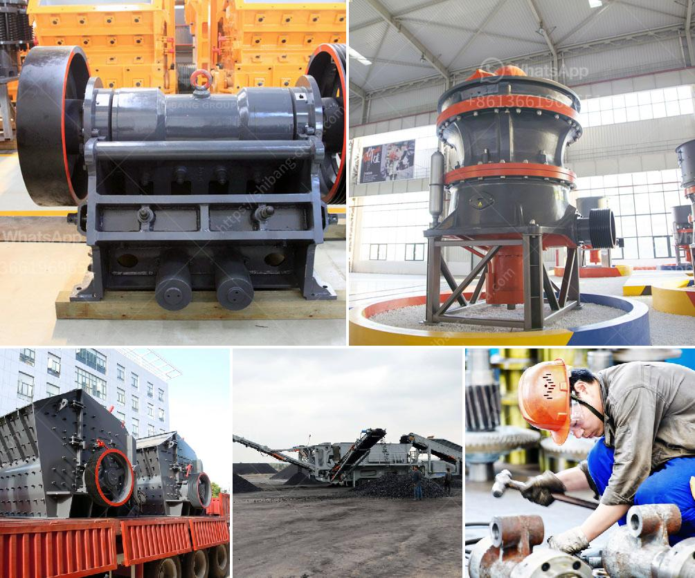

<h3>price of mobile crusher in the philippines</h3>
The mobile crusher in the Philippines is an essential piece of machinery that is helpful in breaking down large rocks into smaller pieces. This crushing device is a must-have in the construction industry because it reduces the cost of aggregate production. It is beneficial to have a mobile crusher in the Philippines because it can process a wide array of minerals and rocks, and it enables mining operators to efficiently process raw materials onsite.

The price of a mobile crusher in the Philippines depends on the model, specification, and the equipment configuration. Mobile crushing plants are higher in cost when compared to stationary crushing equipment. Because of the mobile crusher’s ability to move around on the job site, it reduces transportation costs for miners. The initial investment required for a mobile crusher in the Philippines is also reasonable. In addition, a mobile crusher not only meets the basic crushing requirements but also helps improve resource utilization and enhance overall efficiency.

When searching for a mobile crusher in the Philippines, there are several factors to consider. First is the machine’s type and specification. Different types of crushers have different specifications and capabilities. For instance, cone crushers are suitable for crushing hard materials, while impact crushers are more suitable for processing softer materials. The processing capacity of a crusher is another important consideration. Mobile crushers with higher processing capacity tend to have higher prices.

Moreover, the brand and reputation of the equipment manufacturer can affect the price. Well-known and reputable brands may have higher prices compared to lesser-known ones. However, it is essential to choose a mobile crusher that is reliable and durable to ensure its long-term use. Buying from a reputable manufacturer will provide assurance of quality.

The size and weight of the mobile crusher are also important factors to consider. Smaller and lighter crushers are generally cheaper. However, it is important to balance the size and weight with the required processing power and capacity to ensure optimal performance.

Lastly, the additional features and accessories of the mobile crusher can affect its price. Some crushers come with additional features such as remote control operation, which provides convenience and improves safety. Other features, such as noise reduction and dust suppression systems, can also affect the price. It is important to consider these additional features and assess their value based on the specific needs of the mining operation.

In conclusion, the price of a mobile crusher in the Philippines depends on various factors such as the machine’s type, specifications, processing capacity, brand reputation, size, weight, and additional features. While cost is a crucial consideration, it is equally important to prioritize features and quality to ensure efficient and reliable performance. With the right mobile crusher, mining operators can improve productivity, reduce costs, and maximize the value of their resources.
<h3>Contact us</h3><ul><li><strong>Whatsapp:&nbsp;<a href="https://wa.me/8613661969651">+8613661969651</a></strong></li><li><a href="https://swt.shibang-china.com/?git&amp;zhl&amp;price of mobile crusher in the philippines"><strong>Online Service(chat now)</strong></a></li></ul><h3>Related</h3><ul><li><a href='how to set up a crushing plant.md'>how to set up a crushing plant</a></li><li><a href='cost cement plant manufacturers and cost.md'>cost cement plant manufacturers and cost</a></li><li><a href='ton grinding unit cement plant cost.md'>ton grinding unit cement plant cost</a></li><li><a href='mets ball mill specification.md'>mets ball mill specification</a></li><li><a href='stone quarrying machines in dubai.md'>stone quarrying machines in dubai</a></li></ul>