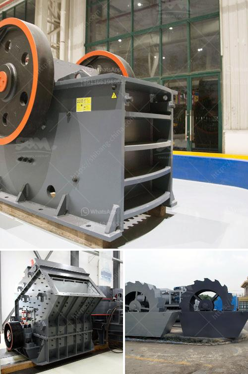

<h3>price of small scale cement plant in india</h3>
A small scale cement plant in India can vary from as low as 2 lakh rupees to upwards of 10 crore rupees. In addition, there are a number of factors that influence the final price, including the location of the plant, the scale of production, the availability of raw materials and machinery, and the local market conditions.

One of the main factors that determine the price of a small scale cement plant in India is the location. Cement plants need to be near sources of limestone, which is the key raw material used in cement production. In regions where limestone is abundant, the cost of establishing a plant is relatively low. Conversely, in areas with limited limestone deposits, transporting the material to the plant can be expensive, pushing up the overall cost.

Another important consideration is the scale of production. A small scale cement plant can range from a capacity of 100 tpd to as high as 1000 tpd. The overall cost of the plant will be heavily influenced by the size and scope of the project. However, the presence of highly efficient machinery can lower the cost per unit of production, allowing for competitive pricing in the market.

The availability of raw materials and machinery is another crucial factor. Cement plants require a steady supply of limestone, clay, and other materials. Despite the abundance of limestone in India, the quality and accessibility of the resource can vary. This can impact the cost of production, as high-quality limestone may need to be sourced from distant locations or imported, adding to the overall cost.

Machinery is another major component of the plant's cost. The modernization and automation of cement production have led to the development of advanced machinery that increases efficiency and reduces labor costs. However, these machines come at a price. Small scale plants may opt for older, second-hand machinery to reduce costs, but this can impact the overall efficiency and productivity of the plant.

Finally, local market conditions play a significant role in determining the price of a small scale cement plant in India. Cement is a highly competitive industry, and the prices of cement are subject to fluctuations based on demand and supply dynamics. In regions with a high demand for cement, the plant can command higher prices for its products, allowing for a potentially quicker return on investment.

In conclusion, the price of a small scale cement plant in India can vary widely depending on a range of factors, including the location, scale of production, availability of raw materials and machinery, and local market conditions. It is essential for potential investors to thoroughly evaluate these factors and conduct a comprehensive cost analysis before making any investment decisions.
<h3>Contact us</h3><ul><li><strong>Whatsapp:&nbsp;<a href="https://wa.me/8613661969651">+8613661969651</a></strong></li><li><a href="https://swt.shibang-china.com/?git&amp;zhl&amp;price of small scale cement plant in india"><strong>Online Service(chat now)</strong></a></li></ul><h3>Related</h3><ul><li><a href='sand making plant.md'>sand making plant</a></li><li><a href='mobile asphalt plant for sale in dubai.md'>mobile asphalt plant for sale in dubai</a></li><li><a href='quote for sand making machine.md'>quote for sand making machine</a></li><li><a href='crusher machine on philippines pakistan.md'>crusher machine on philippines pakistan</a></li><li><a href='artificial stone production plant in turkey.md'>artificial stone production plant in turkey</a></li></ul>