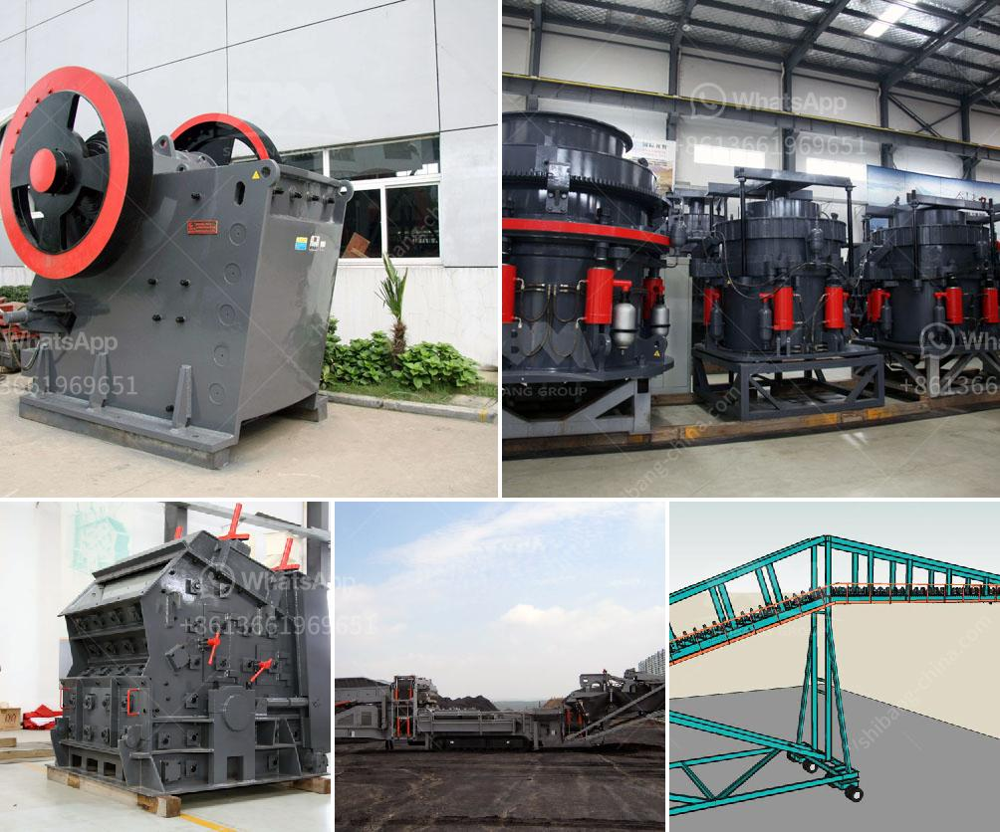

<h3>price of smallest ballast crusher in kenya</h3>
The price of a small ballast crusher in Kenya is influenced by many factors. Firstly, the production capacity of the machine has a great impact on the price of the machine. Therefore, the production capacity of the small ballast crusher can range from 1-3 tons per hour to 10-20 tons per hour. Secondly, the required discharge port size affects the price of the machine. The smaller the discharge port, the higher the price of the machine. Thirdly, whether the power supply is electric or diesel also affects the price. Generally, diesel-powered machines are a bit more expensive than electric ones.

In addition to these factors, the quality of the small ballast crusher also greatly affects its price. Generally, high-quality machines are more expensive, but they also tend to be more durable and efficient. Therefore, it is important to consider the overall quality and reliability of the machine before making a purchase.

It is worth noting that the prices of small ballast crushers vary from supplier to supplier and region to region. Therefore, it is advisable to compare prices from different suppliers and consider the overall reputation and customer reviews of the supplier before making a purchase.

Overall, the price of a small ballast crusher in Kenya is influenced by various factors, including the production capacity, discharge port size, power supply, and overall quality of the machine. As a buyer, it is important to obtain multiple quotes from different suppliers and make an informed decision based on your specific needs and budget.
<h3>Contact us</h3><ul><li><strong>Whatsapp:&nbsp;<a href="https://wa.me/8613661969651">+8613661969651</a></strong></li><li><a href="https://swt.shibang-china.com/?git&amp;zhl&amp;price of smallest ballast crusher in kenya"><strong>Online Service(chat now)</strong></a></li></ul><h3>Related</h3><ul><li><a href='price china industrial ball mill.md'>price china industrial ball mill</a></li><li><a href='small rock crusher mining.md'>small rock crusher mining</a></li><li><a href='mining process of dolomite ryamond mill in kenya.md'>mining process of dolomite ryamond mill in kenya</a></li><li><a href='feldspar ball mill porcess.md'>feldspar ball mill porcess</a></li><li><a href='mtw grinding mill.md'>mtw grinding mill</a></li></ul>