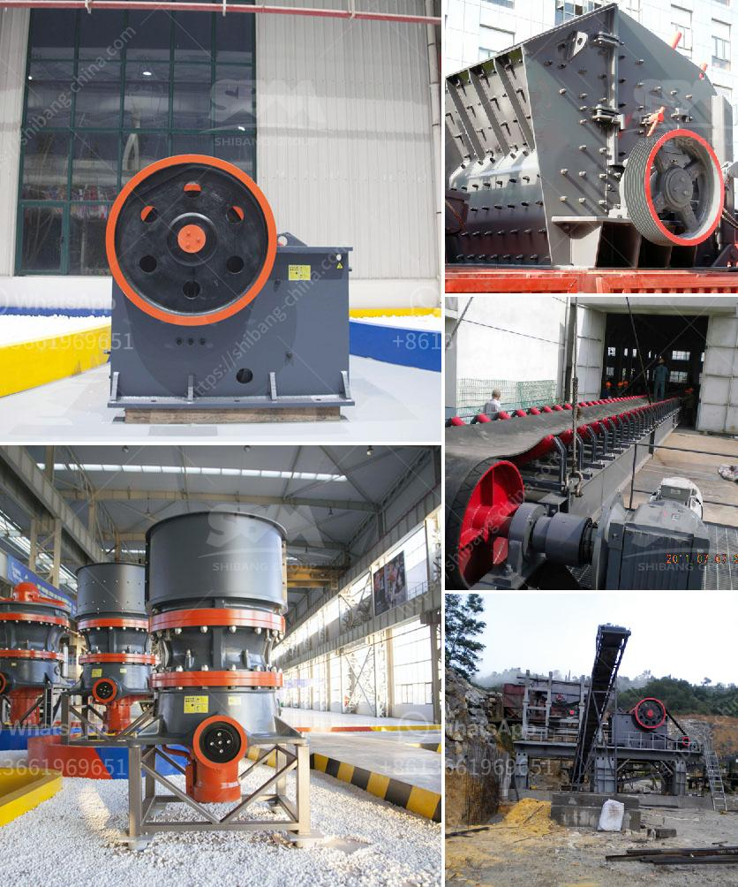

<h3>price of stone crusher machine in pakistan</h3>
Stone crusher machine price in Pakistan is a crucial factor for most customers. In this market, there are various stone crusher machine manufacturers, some of them are not completely reliable. However, SBM can be a trustworthy manufacturer. According to our customers' experience, the price of stone crusher machine in Pakistan from SBM can be considered as exorbitant.

It is worth mentioning that our crusher machine price is very reasonable and affordable. The cost of purchasing a crusher machine in Pakistan directly affects the overall operation of the company. As a result, it is essential to consider the machine's price before starting a business. However, there are various factors that influence the price of the stone crusher machine.

Firstly, the price of a stone crusher machine depends on the capacity and output size of the machine. Higher capacity and larger output size will cost more. Secondly, the type of stone crusher machine also influences the price. Different machine types have different production capacities, and different output sizes. Therefore, the price varies according to the machine type.

Furthermore, the brand and manufacturer of the stone crusher machine also affect its price. SBM, as a well-known crusher machine manufacturer, offers different types of stone crushing machines with different capacities, production outputs, and sizes. They are widely used in Pakistan, providing high efficiency and low operating costs.

In addition to the above factors, the price of stone crusher machine in Pakistan also depends on the market demand. There are different Stone Crusher Machine in Pakistan as per the desired product quality capacity, size, and market demand. The market demand for stone crusher machine is continuously growing due to the increasing infrastructure development in the country and the expanding construction industry.

Another critical factor in determining the price of stone crusher machine is the materials used to manufacture the machine. Good quality materials ensure longer machine life and fewer maintenance issues, resulting in higher prices. However, it is recommended to invest in a stone crusher machine that uses superior quality materials to ensure its longevity and durability.

Overall, the price of stone crusher machine in Pakistan is influenced by various factors, including capacity, output size, machine type, brand, manufacturer, market demand, and materials used. These factors strongly determine the price of stone crusher machine in the market.

Therefore, if you want to buy a stone crusher machine in Pakistan, please carefully consider these factors and choose a reliable manufacturer like SBM to ensure the best quality and reasonable price.
<h3>Contact us</h3><ul><li><strong>Whatsapp:&nbsp;<a href="https://wa.me/8613661969651">+8613661969651</a></strong></li><li><a href="https://swt.shibang-china.com/?git&amp;zhl&amp;price of stone crusher machine in pakistan"><strong>Online Service(chat now)</strong></a></li></ul><h3>Related</h3><ul><li><a href='horizontal stone ball mill.md'>horizontal stone ball mill</a></li><li><a href='working principle structure of stone crusher.md'>working principle structure of stone crusher</a></li><li><a href='cement mill liner manufacturers in india.md'>cement mill liner manufacturers in india</a></li><li><a href='marble quarry mining crusher in sudan.md'>marble quarry mining crusher in sudan</a></li><li><a href='used cone crushers zambia.md'>used cone crushers zambia</a></li></ul>