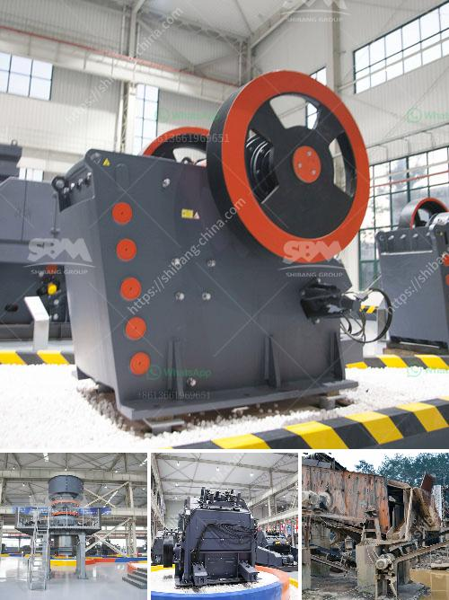

<h3>prices continuous ball mill</h3>
The continuous ball mill is a type of grinder that is used to grind and blend materials. It works on the principle of impact and attrition. The continuous ball mill operates with an intermittent feeding and discharging process, which ensures continuous grinding. This mill is able to grind raw materials such as limestone or clinker into fine powder.

When it comes to price, the continuous ball mill is more expensive than the batch ball mill. This is because it requires more energy and labor to operate and maintain. Additionally, the continuous ball mill has a higher capacity and efficiency compared to the batch ball mill. Therefore, it is suitable for large-scale production.

The price of a continuous ball mill varies depending on its size, capacity, and features. Generally, the larger the mill, the higher the price. The average price range of a continuous ball mill is between $5,000 and $50,000.

However, if you are looking for a high-quality and durable machine, it is worth investing in a continuous ball mill. The long-term benefits and efficiency it provides will outweigh the initial cost. Moreover, continuous ball mills are widely used in various industries, including cement, minerals, chemicals, and construction materials.

When purchasing a continuous ball mill, it is important to consider the after-sales service and warranty provided by the manufacturer. Additionally, it is advisable to compare prices and features offered by different manufacturers to make an informed decision.

In conclusion, the continuous ball mill is a versatile and efficient grinder that is essential for large-scale production. Despite its higher price compared to the batch ball mill, its superior capacity and efficiency make it a worthwhile investment.
<h3>Contact us</h3><ul><li><strong>Whatsapp:&nbsp;<a href="https://wa.me/8613661969651">+8613661969651</a></strong></li><li><a href="https://swt.shibang-china.com/?git&amp;zhl&amp;prices continuous ball mill"><strong>Online Service(chat now)</strong></a></li></ul><h3>Related</h3><ul><li><a href='buy used crushing coal screen plant.md'>buy used crushing coal screen plant</a></li><li><a href='trommel screen capacity calculation.md'>trommel screen capacity calculation</a></li><li><a href='price of a rock crusher.md'>price of a rock crusher</a></li><li><a href='mobile roller crushers in south africa.md'>mobile roller crushers in south africa</a></li><li><a href='coal beneficiation.md'>coal beneficiation</a></li></ul>