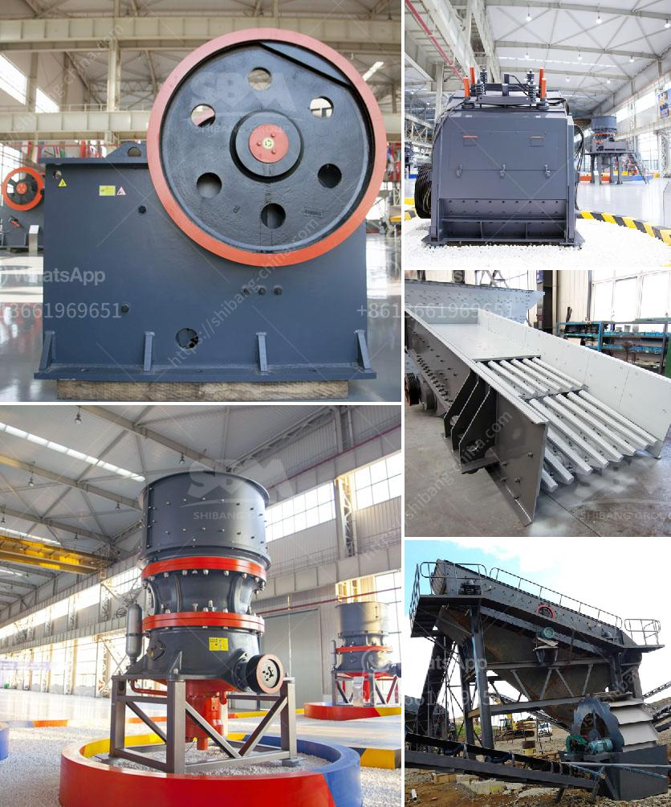

<h3>prices for ball mill in south africa</h3>
The Ball Mill in South Africa is crucial equipment for grinding industries, its round and cylindrical shape enables it to deliver efficient grinding results, and it comes in different sizes and specifications, making it an ideal choice for various industrial applications.

This machine is commonly used in cement plants, mining industry, power plants, metallurgical industry, and more. It uses grinding balls to pulverize materials within the rotating cylinder, which ensures smooth and efficient grinding operations. 

When it comes to prices for Ball Mills in South Africa, they vary based on the different specifications and the applications. Various Ball Mill in South Africa prices are as follows:

- The Ball Mill with capacity 100-300t/h is suitable for medium-sized plants, while the maximum capacity of the Ball Mill ranges from 40-100t/h for large-scale projects. Therefore, there are different models suitable for different fields, such as South Africa's cement plants, beneficiation plants, power plants, and more.

- The price of a Ball Mill in South Africa is within the industry average and can vary depending on the size and specifications of the machine. The approximate price range is between 3,000 to 30,000 US dollars.

- Additionally, the cost of Ball Mills in South Africa is affordable for most businesses, ensuring that they can invest in this crucial equipment without causing a financial burden.

- It is worth mentioning that the high quality and reliability of the Ball Mill make it a wise and economical choice in the long run. Investing in a trusted supplier with a strong reputation in the industry ensures that the machine will perform optimally, leading to better productivity and efficiency.

To sum up, the prices for Ball Mills in South Africa are affordable, making them widely accessible to different industries. The machines' ability to deliver efficient grinding results and their adaptability to various applications make them indispensable for businesses looking to enhance their operations. Whether for cement plants, mining sector, or power plants, the Ball Mill in South Africa is a valuable investment opportunity.
<h3>Contact us</h3><ul><li><strong>Whatsapp:&nbsp;<a href="https://wa.me/8613661969651">+8613661969651</a></strong></li><li><a href="https://swt.shibang-china.com/?git&amp;zhl&amp;prices for ball mill in south africa"><strong>Online Service(chat now)</strong></a></li></ul><h3>Related</h3><ul><li><a href='manufacturer of barite in pakistan.md'>manufacturer of barite in pakistan</a></li><li><a href='gypsum board preparation process.md'>gypsum board preparation process</a></li><li><a href='barite mining process with photos.md'>barite mining process with photos</a></li><li><a href='jaw crusher manufacturer in italy.md'>jaw crusher manufacturer in italy</a></li><li><a href='iron ore mines buyers in india.md'>iron ore mines buyers in india</a></li></ul>