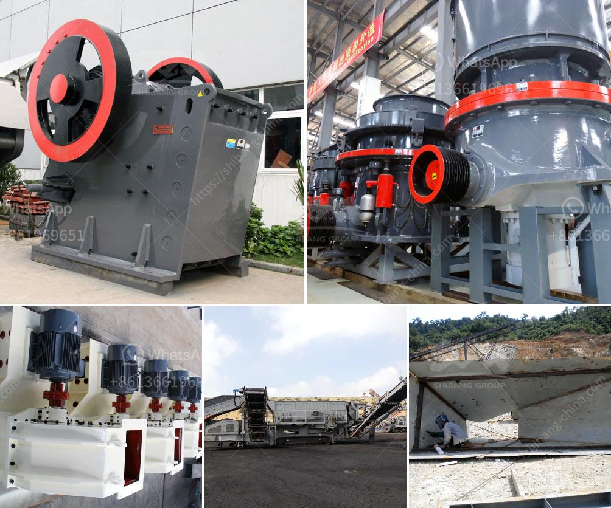

<h3>prices of industrial mills prices of crushing plant</h3>
Industrial mills play a vital role in various sectors, including mining, manufacturing, and construction. These powerful machines are responsible for crushing and grinding materials into smaller particles, facilitating vital processes in numerous industries. Understanding the prices of industrial mills, particularly crushing plants, is essential for businesses to make informed decisions. In this article, we will delve into the factors that influence the prices of such plants.

The capacity of a crushing plant is one of the primary factors affecting its price. A crushing plant with a higher capacity is capable of processing a larger amount of material, leading to improved productivity. Naturally, higher capacity plants generally come with a higher price tag due to increased manufacturing and operational costs. The scale of the project and production requirements should be carefully assessed to determine the optimal plant capacity and potential associated costs.

Technological advancements and innovative designs drive the efficiency, performance, and prices of industrial mills. Crushing plants equipped with cutting-edge technologies, such as advanced automation systems or state-of-the-art control mechanisms, tend to command higher prices. These features improve productivity, reduce downtime, enhance safety, and ensure a higher quality end-product.

The quality of materials and components used in the construction of an industrial mill significantly impacts its price. High-quality materials and components enhance durability, reduce maintenance requirements, and extend the lifespan of the machine. While initial costs may be higher, investing in top-notch materials and components can yield long-term benefits by minimizing operational costs and maximizing overall productivity.

The reputation and experience of the manufacturer also play a significant role in determining the price of industrial mills. Established manufacturers often command higher prices due to their expertise, reliable customer support, and well-established supply chains. Brand value, warranty offers, and customer service also contribute to the overall cost.

Supply and demand dynamics, global economic trends, and the competition among manufacturers can all influence the price of industrial mills. Fluctuations in raw material costs, such as steel, can directly impact mill prices. Market demand, competition, and geopolitical factors can also influence pricing decisions.

Investing in an industrial mill, especially a crushing plant, requires careful consideration to ensure the right balance between price and performance. Key factors such as plant capacity, technology and design, material and component quality, manufacturer reputation, and market dynamics all contribute to the final pricing decisions. By thoroughly understanding these factors, businesses can make informed choices that align with their specific requirements and budget, ultimately contributing to increased efficiency and profitability in their operations.
<h3>Contact us</h3><ul><li><strong>Whatsapp:&nbsp;<a href="https://wa.me/8613661969651">+8613661969651</a></strong></li><li><a href="https://swt.shibang-china.com/?git&amp;zhl&amp;prices of industrial mills prices of crushing plant"><strong>Online Service(chat now)</strong></a></li></ul><h3>Related</h3><ul><li><a href='hammer mill 50 hr.md'>hammer mill 50 hr</a></li><li><a href='mini rock crusher.md'>mini rock crusher</a></li><li><a href='rubber grinder machine in philippines.md'>rubber grinder machine in philippines</a></li><li><a href='components of a ball mill.md'>components of a ball mill</a></li><li><a href='small portable swing jaw crushers.md'>small portable swing jaw crushers</a></li></ul>