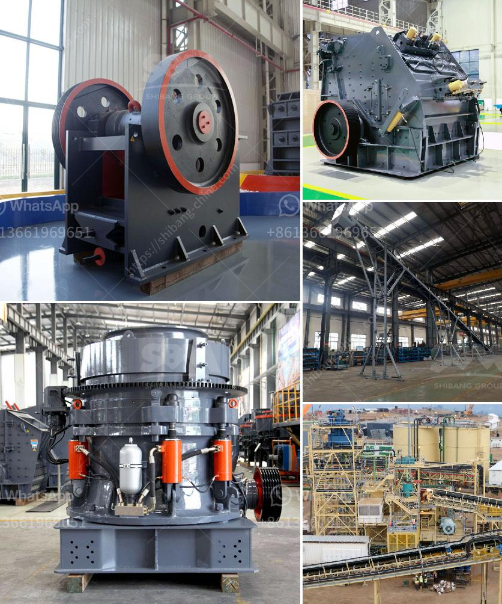

<h3>prices of stone crushers from nigeria</h3>
Stone Crushers are a vital piece of equipment in many industries. The demand for these machines is increasing due to a shift in the way industries operate. Widely used in construction and mining industries, stone crushers are designed to reduce the size of large rocks and stones into smaller pieces to better suit the requirements of the intended use.

In Nigeria, the cost of stone crusher price is fairly competitive. However, in recent years, due to inflation and the weak Nigerian currency, prices of stone crushers in Nigeria have risen dramatically and this threatens to affect the growth of the Nigerian mining and construction industry.

One of the main factors driving the increasing cost of stone crushers in Nigeria is the inflation rate. Inflation refers to the general increase in prices of goods and services over a period of time. It happens when the demand for goods and services exceeds their supply, causing prices to rise. In Nigeria, the inflation rate has been on the rise in recent years, making the cost of stone crushers increase significantly.

Another factor contributing to the rising prices of stone crushers in Nigeria is the weak Nigerian currency. The Nigerian Naira has been facing depreciation against major currencies like the US dollar, euro, and pound sterling. When the Nigerian currency weakens, it increases the cost of importing goods and machinery, including stone crushers. As a result, the prices of stone crushers in Nigeria have surged, making it difficult for industry players to acquire them for their operations.

Furthermore, the high cost of transportation in Nigeria also adds to the overall cost of stone crushers. Nigeria is a country with inadequate transportation infrastructure, and this has a direct impact on the prices of goods and services. Stone crushers are heavy machinery, and transporting them from one location to another can be quite expensive, especially if the distance is long or the roads are in poor condition. As a result, the cost of stone crushers in Nigeria is higher compared to neighboring countries.

To mitigate the rising cost of stone crushers in Nigeria, the Nigerian government should invest in infrastructural development. Improving transportation infrastructure and constructing better roads will significantly reduce the cost of transporting heavy machinery like stone crushers. Additionally, the government should address the issue of inflation and stabilize the Nigerian currency to ensure a competitive and affordable market for stone crushers.

In conclusion, the prices of stone crushers in Nigeria have risen due to multiple factors including inflation, weak currency, and high transportation costs. These factors threaten to affect the growth of the Nigerian mining and construction industry. To address this issue, the Nigerian government should invest in infrastructure development and stabilize the currency to create a favorable market for stone crushers. By doing so, the cost of stone crushers will become more affordable, leading to a boost in the industry and overall economic growth.
<h3>Contact us</h3><ul><li><strong>Whatsapp:&nbsp;<a href="https://wa.me/8613661969651">+8613661969651</a></strong></li><li><a href="https://swt.shibang-china.com/?git&amp;zhl&amp;prices of stone crushers from nigeria"><strong>Online Service(chat now)</strong></a></li></ul><h3>Related</h3><ul><li><a href='european stone crusher.md'>european stone crusher</a></li><li><a href='ball mills manufacturers in india.md'>ball mills manufacturers in india</a></li><li><a href='small rock gravel crushers.md'>small rock gravel crushers</a></li><li><a href='chrome washing machine plant eluvial.md'>chrome washing machine plant eluvial</a></li><li><a href='used mobile screens and crusher in africa.md'>used mobile screens and crusher in africa</a></li></ul>