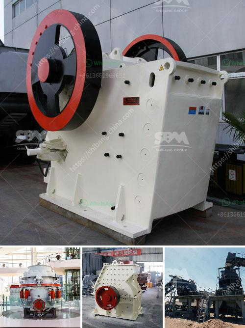

<h3>prices of stone crushers in johannesburg</h3>
The stone crusher industry in Johannesburg is well-established and diverse due to the abundant resources and various companies that manufacture and distribute stone crushers in the area. The prices of these stone crushers can vary significantly based on factors such as the supplier's reputation, market demand, competition, and material specifications.

Firstly, it is important to understand the different types of stone crushers available in the market. They can be categorized into primary, secondary, and tertiary crushers. Primary crushers are the initial units used to crush raw materials into smaller pieces, while secondary and tertiary crushers further refine the crushed stones into the desired size and shape.

In Johannesburg, prices for stone crushers can range from around R10,000 to R30,000 for small-scale units. These machines are usually used for the processing of raw materials into smaller pieces such as gravel, sand, or dust. The size and type of the crusher will ultimately determine its price. For instance, a small jaw crusher that can crush around 200-300mm stones will be cheaper than a larger cone crusher capable of crushing stones up to 500mm.

Furthermore, the reputation of the supplier plays a significant role in determining the price of stone crushers. Established suppliers with a credible track record and positive customer reviews tend to charge higher prices than new or lesser-known suppliers. This is due to the trust and quality assurance associated with reputed suppliers.

Market demand and competition also influence stone crusher prices in Johannesburg. If there is a high demand for stone crushers and limited competition in the market, suppliers have the advantage of charging higher prices. On the other hand, intense competition among suppliers can result in lower prices as they strive to attract customers.

Lastly, the material specifications of the stone crushers impact their prices. Different types of stones, such as granite, limestone, or basalt, have varying hardness levels, which influence the design and strength requirements of the crushers. Consequently, crushers used for harder stones tend to be more expensive due to the quality and robustness of their construction.

In conclusion, the prices of stone crushers in Johannesburg are influenced by factors such as supplier reputation, market demand, competition, and material specifications. Customer research and comparison among suppliers are vital for obtaining the best value for money. By understanding these factors, potential buyers can make informed decisions and select the most suitable stone crusher that meets their requirements within their budget.
<h3>Contact us</h3><ul><li><strong>Whatsapp:&nbsp;<a href="https://wa.me/8613661969651">+8613661969651</a></strong></li><li><a href="https://swt.shibang-china.com/?git&amp;zhl&amp;prices of stone crushers in johannesburg"><strong>Online Service(chat now)</strong></a></li></ul><h3>Related</h3><ul><li><a href='small scale gold cip processing.md'>small scale gold cip processing</a></li><li><a href='advance stone agregate crusher equipments.md'>advance stone agregate crusher equipments</a></li><li><a href='industrial gold mining equipment suppliers.md'>industrial gold mining equipment suppliers</a></li><li><a href='dolomite beneficiation.md'>dolomite beneficiation</a></li><li><a href='roller grinding mill vibration.md'>roller grinding mill vibration</a></li></ul>