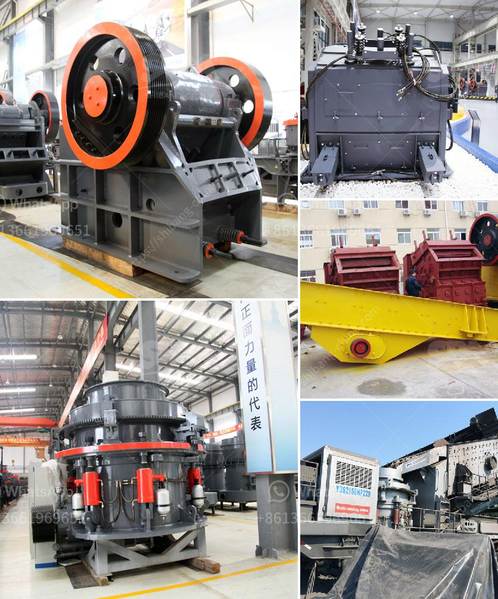

<h3>primary impact crusher disadvantages</h3>
A primary impact crusher is a machine that uses striking as opposed to pressure to reduce the size of a material. These machines are typically used in quarries, gravel pits, and other types of aggregate production facilities to break down various types of rocks into smaller, more manageable pieces. While primary impact crushers offer several advantages, such as high reduction ratios and relatively low operational costs, there are also a few disadvantages that need to be considered. In this article, we will explore some of the drawbacks of primary impact crushers and potential solutions to overcome them.

1. High energy consumption: One of the major disadvantages of primary impact crushers is their high energy consumption. Compared to compression crushers like jaws and cones, impact crushers consume significantly more power. This results in higher operating costs and increased carbon emissions.

To mitigate this issue, manufacturers have been working on improving the energy efficiency of these machines. For example, some models now feature advanced hydraulic systems that optimize power usage. Furthermore, regular maintenance and proper equipment selection can help ensure optimal performance and energy efficiency.

2. Limited reduction ratio: Another disadvantage of primary impact crushers is their relatively limited reduction ratio. Compared to compression crushers, such as cone crushers, primary impact crushers have a maximum reduction ratio of about 10:1. This means that larger chunks of material may require secondary or tertiary crushing to achieve the desired size reduction.

To overcome this limitation, operators can employ secondary and tertiary impact crushers or screens to further process the material. By using a combination of crushers, the overall reduction ratio can be increased, enabling the production of finer and more uniform end products.

3. High wear and maintenance requirements: Primary impact crushers experience high levels of wear and tear due to the constant impact of materials against the rotor and the breaker plates. This results in increased maintenance needs and downtime for replacements.

Using durable materials for the construction of impact crusher components, such as high-strength steel and wear-resistant alloys, can help improve their longevity. Routine inspections and preventative maintenance can also identify potential issues before they result in major breakdowns.

4. Dust generation: Primary impact crushers can generate a significant amount of dust during operation. This can pose a health hazard to workers and cause environmental pollution.

To minimize dust emissions, several measures can be taken. These include installing dust suppression systems, enclosing the crusher with a protective housing, and implementing proper ventilation systems. Regular cleaning and maintenance of the crusher and surrounding areas are also essential to prevent dust accumulation.

In conclusion, primary impact crushers offer various advantages in terms of high production capacity and low operational costs. However, they also come with a few disadvantages that need to be considered. By addressing issues such as energy consumption, limited reduction ratios, high wear and maintenance requirements, and dust generation, operators can optimize the performance and efficiency of primary impact crushers. Additionally, regular maintenance, proper equipment selection, and adopting best practices can help mitigate these drawbacks and make the most out of these powerful machines.
<h3>Contact us</h3><ul><li><strong>Whatsapp:&nbsp;<a href="https://wa.me/8613661969651">+8613661969651</a></strong></li><li><a href="https://swt.shibang-china.com/?git&amp;zhl&amp;primary impact crusher disadvantages"><strong>Online Service(chat now)</strong></a></li></ul><h3>Related</h3><ul><li><a href='small scall stone crushing machine.md'>small scall stone crushing machine</a></li><li><a href='business plan for a cement plant.md'>business plan for a cement plant</a></li><li><a href='granite crusher machine companies.md'>granite crusher machine companies</a></li><li><a href='sand mining equipment malaysia.md'>sand mining equipment malaysia</a></li><li><a href='mobile jaw crusher for sale south africa.md'>mobile jaw crusher for sale south africa</a></li></ul>