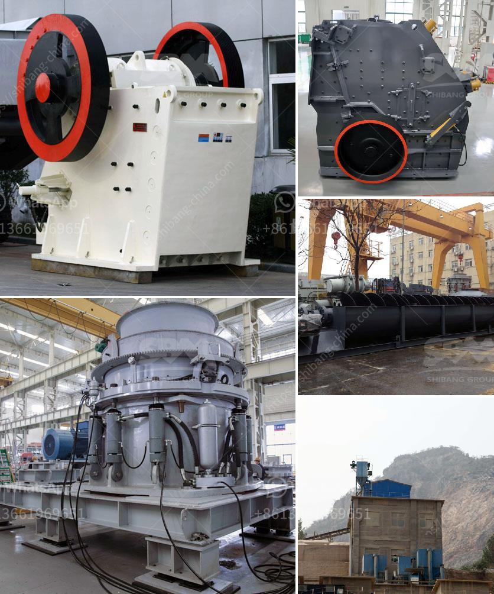

<h3>primary jaw crusher</h3>
The primary jaw crusher is commonly used in mining and stone-processing companies for crushing and grinding materials. Due to its simple structure, sturdy construction, and reliable operation, it has been widely used in sectors such as metallurgy, mining, building materials, chemical engineering, coal, and so on. The primary jaw crusher is capable of processing various types of ore and rock with a compressive strength of up to 320MPa.

The primary jaw crusher is designed to crush large pieces of ore and rock in a quarry or mine setting. It consists of a fixed and a movable jaw, also known as a pitman and a swing jaw. The movement of the swing jaw facilitates the ore or rock being crushed by applying force to it, resulting in the breaking down into smaller pieces.

One of the key features of the primary jaw crusher is its high efficiency and low energy consumption. This machine utilizes a fixed jaw plate and a moving jaw plate to form a wedge-shaped crushing chamber where the materials are repeatedly pressed, crushed, and impacted until they are reduced to the desired size. As a result, the primary jaw crusher offers a higher production capacity and greater reduction ratio than other crushing machines.

Another advantage of the primary jaw crusher is its versatility. This machine can crush a wide range of materials, such as granite, marble, basalt, limestone, quartz stone, river pebble, iron ore, copper ore, etc. The primary jaw crusher is also suitable for crushing various hard and abrasive materials. With its high wear resistance, it can effectively prolong the service life of wear parts, reducing the maintenance and replacement frequency.

Furthermore, the primary jaw crusher is designed with a large crushing cavity, which enhances the feeding capacity and output. It allows materials to be uniformly distributed, reducing the phenomenon of uneven feeding and blockage. This contributes to a steady and continuous production process, ensuring the smooth operation of the entire crushing system.

In addition to its technical advantages, the primary jaw crusher also offers economical benefits. It is relatively low in cost compared to other types of crushers. Its simple structure and reliable performance contribute to a lower downtime and maintenance cost. Moreover, the primary jaw crusher consumes less power, reducing the overall energy consumption of the crushing process.

Overall, the primary jaw crusher is an essential machine in the mining and stone-processing industry. With its high efficiency, versatility, and economical benefits, it has become a popular choice for crushing various types of materials. Whether it is used in a small-scale quarry or a large-scale mining operation, the primary jaw crusher is capable of meeting the demands of crushing and grinding processes effectively.
<h3>Contact us</h3><ul><li><strong>Whatsapp:&nbsp;<a href="https://wa.me/8613661969651">+8613661969651</a></strong></li><li><a href="https://swt.shibang-china.com/?git&amp;zhl&amp;primary jaw crusher"><strong>Online Service(chat now)</strong></a></li></ul><h3>Related</h3><ul><li><a href='millia deasel grinding mill and prices.md'>millia deasel grinding mill and prices</a></li><li><a href='rock crusher for chromium or chromite ore.md'>rock crusher for chromium or chromite ore</a></li><li><a href='crushing plant price.md'>crushing plant price</a></li><li><a href='grinding tools dealers in nigeria.md'>grinding tools dealers in nigeria</a></li><li><a href='jaw crusher prices saudi.md'>jaw crusher prices saudi</a></li></ul>