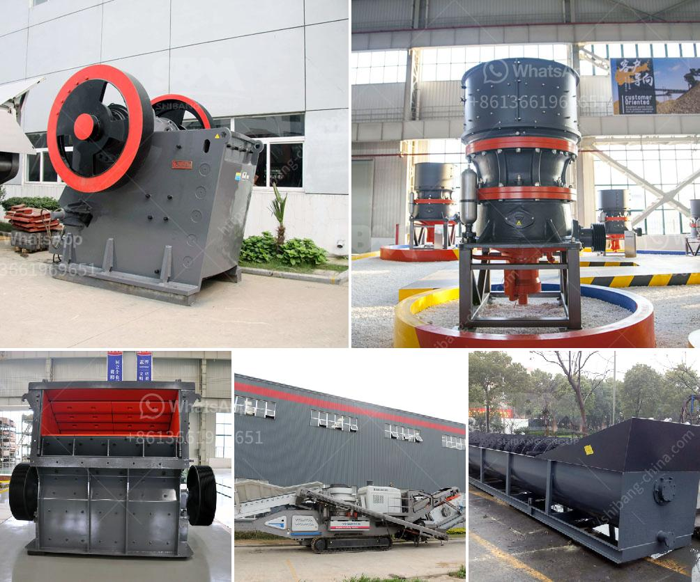

<h3>process of preparing clay crusher</h3>
The process of preparing clay has been around for centuries. In fact, many ancient civilizations used clay as a building material, and some even made pottery with it. Today, clay is still widely used in various industries, including construction, ceramics, and even in the pharmaceutical industry. One of the essential steps in preparing clay for these applications is the crushing process. This article will explore the process of preparing clay crusher.

The first step in the process of preparing clay crusher is to obtain a suitable clay deposit. This can be done through a variety of methods, such as mining or dredging. Once a clay deposit is found, it is then extracted from the ground or body of water using heavy machinery.

After the clay has been extracted, it is brought to a processing plant where it is prepared for crushing. The clay is usually transported to the plant by trucks or conveyor belts. At the plant, the clay is thoroughly cleaned to remove any impurities, such as rocks, stones, or other foreign objects.

Once the clay has been cleaned, it is then crushed into smaller pieces using crushers. The crushers can be either jaw crushers or impact crushers. Jaw crushers use a stationary plate and a moving plate to create a V-shaped opening between them, which is used to crush the clay. On the other hand, impact crushers use a high-speed rotor and anvils for impact crushing.

The size of the crushed clay can vary depending on the desired final product. For example, clay for ceramics may require a finer size compared to clay used in construction. To achieve the desired size, the clay may go through a series of crushers or be screened to separate the different sizes.

After the clay has been crushed, it may undergo further processing, such as blending or drying. Blending is done to ensure that the clay has a consistent composition and properties. This is important in applications where the clay is used to make products with specific characteristics, such as strength or color.

Drying is another important step in the process of preparing clay crusher. This is done to remove any excess moisture from the clay, as moisture can affect the properties of the final product. Drying can be done naturally, by exposing the clay to sunlight and air, or artificially, using ovens or dryers.

Once the clay has been prepared, it is ready to be used in various applications. In the construction industry, clay can be used to make bricks, tiles, or as a raw material for cement. In the ceramics industry, clay is used to make pottery, ceramics, and porcelain. Clay is also used in the pharmaceutical industry, where it is used to make medicines and supplements.

In conclusion, the process of preparing clay crusher involves extracting, cleaning, crushing, and potentially drying the clay to obtain the desired size and properties. This process is essential for various industries that rely on clay as a raw material. Whether it is used in construction, ceramics, or pharmaceuticals, the preparation of clay is a crucial step in turning the raw material into a useful product.
<h3>Contact us</h3><ul><li><strong>Whatsapp:&nbsp;<a href="https://wa.me/8613661969651">+8613661969651</a></strong></li><li><a href="https://swt.shibang-china.com/?git&amp;zhl&amp;process of preparing clay crusher"><strong>Online Service(chat now)</strong></a></li></ul><h3>Related</h3><ul><li><a href='crushing plant suppliers in pakistan.md'>crushing plant suppliers in pakistan</a></li><li><a href='stone crusher process.md'>stone crusher process</a></li><li><a href='feasibility on quarry business.md'>feasibility on quarry business</a></li><li><a href='mobile stone crusher in germany.md'>mobile stone crusher in germany</a></li><li><a href='jaw crusher materials.md'>jaw crusher materials</a></li></ul>