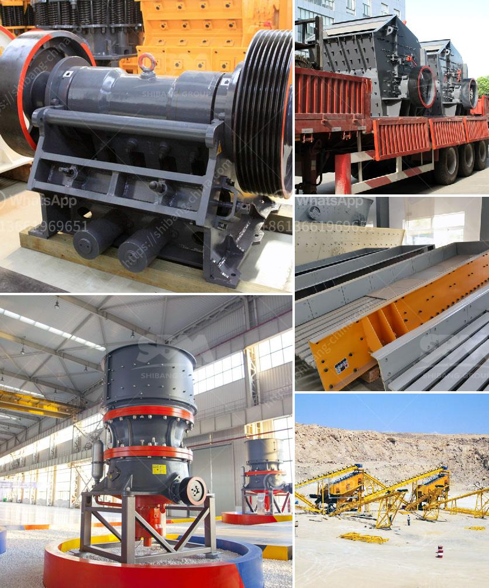

<h3>processing of quartz crusher</h3>
Quartz is a widely used mineral in various industries, including jewelry, glass, ceramics, and electronics. Quartz is known for its durability and high resistance to heat and chemical reactions. This makes it a valuable resource, and the process of extracting and processing quartz into a usable form is an intricate one.

The initial step in processing quartz is the extraction from the mine. This can be done by various methods, including open-pit mining, underground mining, and hydraulic mining. Once the quartz is extracted, it is then crushed and broken down into smaller pieces using a crusher.

A quartz crusher is a machine that is used in crushing minerals, rocks, and other solid materials into smaller pieces. This machine is commonly used in the mining and construction industries, where large rocks need to be crushed into smaller pieces for further processing. The quartz crusher is usually made of steel plates that are used in breaking down the material.

Once the quartz is crushed, it is then sorted and separated based on particle size. This is done using various methods, including screening and washing. Screening involves using a mesh or screen to separate the quartz particles based on size. The smaller particles pass through the mesh, while the larger ones are retained.

Washing, on the other hand, involves using water or other liquids to separate the quartz particles based on density. The heavier particles sink to the bottom, while the lighter ones float to the surface. This process is commonly used to remove impurities from the quartz, resulting in a purer form of the mineral.

After the quartz is sorted and separated, it is then processed further to remove any remaining impurities. This can be done by using chemicals or heat treatment. Chemicals are commonly used in the form of acids to dissolve impurities in the quartz. Heat treatment involves subjecting the quartz to high temperatures to remove impurities through evaporation or decomposition.

Once the quartz is processed and purified, it can then be used in various industries. In the jewelry industry, quartz is often cut and polished into gemstones for use in rings, necklaces, and other accessories. In the glass and ceramics industries, quartz is used as a basic raw material for making glass and ceramics products. In the electronics industry, quartz is used in the production of electronic devices such as watches, clocks, and computers.

In conclusion, the processing of quartz involves several stages, including extraction, crushing, sorting, and purification. Each stage is important in ensuring that the quartz is of high quality and suitable for use in various industries. With its durability and resistance to heat and chemical reactions, quartz continues to be a valuable resource in today's modern world.
<h3>Contact us</h3><ul><li><strong>Whatsapp:&nbsp;<a href="https://wa.me/8613661969651">+8613661969651</a></strong></li><li><a href="https://swt.shibang-china.com/?git&amp;zhl&amp;processing of quartz crusher"><strong>Online Service(chat now)</strong></a></li></ul><h3>Related</h3><ul><li><a href='industrial hammer mill malaysia.md'>industrial hammer mill malaysia</a></li><li><a href='quarry crusher equipment manufacturer in turkey.md'>quarry crusher equipment manufacturer in turkey</a></li><li><a href='double rollar mill.md'>double rollar mill</a></li><li><a href='stone crusher mobile plant di indonesia.md'>stone crusher mobile plant di indonesia</a></li><li><a href='limestone crushing and making sand machine.md'>limestone crushing and making sand machine</a></li></ul>