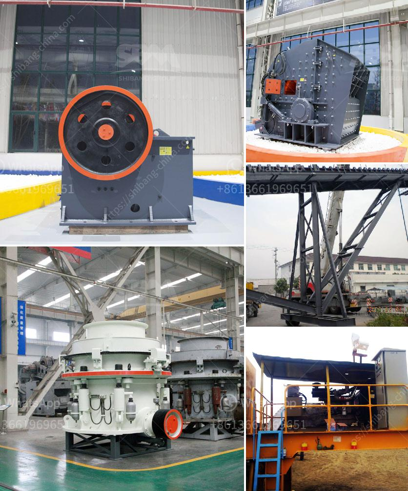

<h3>product of 100 tons mini cement plant</h3>
A 100-ton mini cement plant is a small-scale production facility with the capacity to produce up to 100 tons of cement per day. This compact size makes it ideal for small and medium-sized construction projects. In addition to its size, there are several other advantages to consider when investing in a mini cement plant.

Firstly, the mini cement plant offers cost-effective production. The compact size allows for efficient use of resources, minimizing operating costs. With a lower initial investment compared to larger cement plants, it becomes feasible for entrepreneurs and small businesses to enter the cement manufacturing industry. This opens up opportunities for job creation and local economic development in areas where larger plants may not be practical or economically viable.

Secondly, a mini cement plant provides a more sustainable alternative to traditional cement production. Cement production is a significant contributor to global greenhouse gas emissions. By opting for a mini cement plant with a smaller production capacity, the environmental impact of cement manufacturing can be reduced. This aligns with global efforts to mitigate climate change and transition towards more sustainable construction practices.

Furthermore, a mini cement plant can enhance local production and reduce reliance on imported cement. Many countries depend on cement imports to meet their construction needs. Investing in a mini plant allows for local production, ensuring a consistent and affordable supply of cement. This can also contribute to local economic growth by reducing dependence on foreign imports and creating employment opportunities for the local workforce.

In conclusion, a 100-ton mini cement plant offers a viable solution for small and medium-sized construction projects. With cost-effective production, reduced environmental impact, and enhanced local production, this compact facility provides numerous benefits. As the demand for cement continues to rise, investing in a mini cement plant can be a strategic decision for entrepreneurs, small businesses, and communities looking to boost their local construction industry.
<h3>Contact us</h3><ul><li><strong>Whatsapp:&nbsp;<a href="https://wa.me/8613661969651">+8613661969651</a></strong></li><li><a href="https://swt.shibang-china.com/?git&amp;zhl&amp;product of 100 tons mini cement plant"><strong>Online Service(chat now)</strong></a></li></ul><h3>Related</h3><ul><li><a href='iron ore crusher in pakistan.md'>iron ore crusher in pakistan</a></li><li><a href='vertical mill rock.md'>vertical mill rock</a></li><li><a href='dolomite processing plant cost in india.md'>dolomite processing plant cost in india</a></li><li><a href='trommel small mobile wash plants for sale.md'>trommel small mobile wash plants for sale</a></li><li><a href='business plan on quarry crusher.md'>business plan on quarry crusher</a></li></ul>