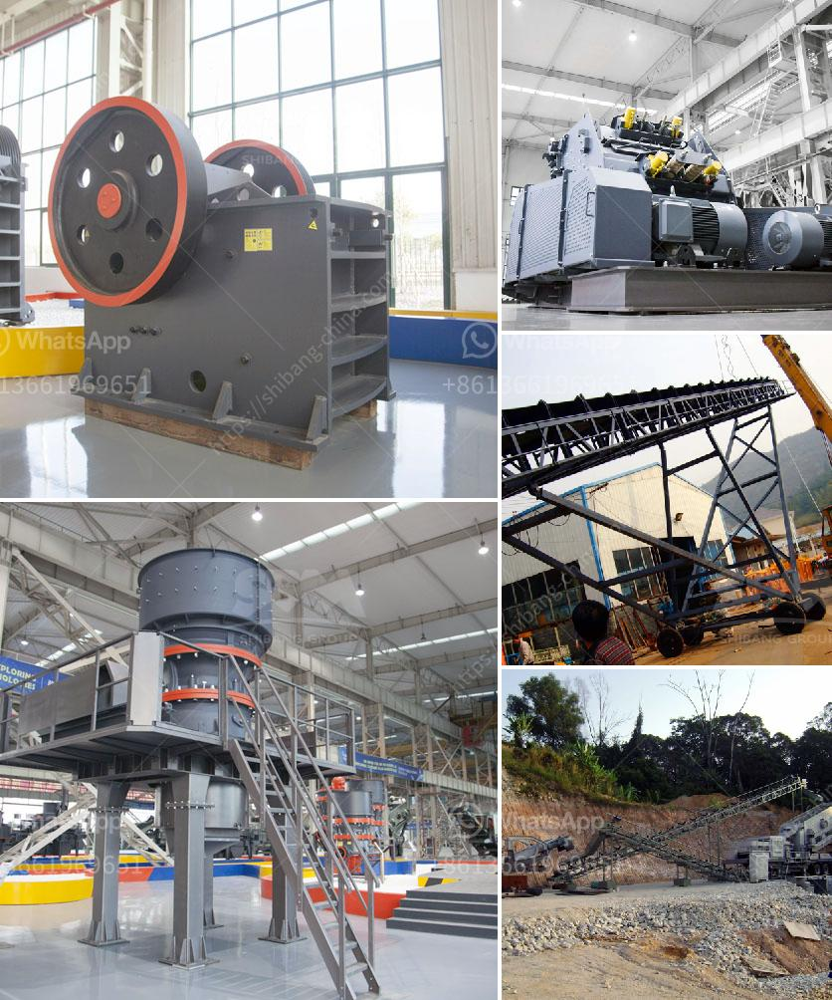

<h3>production of cement mill in algerie</h3>
The production of cement mill in Algeria has been a subject of great interest for many years. As one of the largest producers of cement in the African continent, Algeria stands out as a crucial player in the global cement industry. With its abundant natural resources and strategic location, the country has created a solid foundation for cement production, making it a significant contributor to the Algerian economy.

Algeria has a long history in cement production, dating back to the early 19th century. The industry has undergone significant development over the years, with the construction of modern cement plants and the introduction of advanced technologies. Today, there are numerous cement mills spread across the country, producing high-quality cement to meet both domestic and international demands.

One of the key players in the Algerian cement industry is the LafargeHolcim Group. The company operates several cement mills in Algeria, including the Biskra, M'Sila, and Zahana plants. These facilities have a combined production capacity of over 8 million tons per year, making LafargeHolcim one of the largest cement producers in the country.

The production process in a cement mill involves several stages. The raw materials, including limestone, clay, and gypsum, are extracted from quarries and transported to the plant. These materials are then crushed, ground, and blended to form the raw meal, which is further processed in a kiln at extremely high temperatures. The resulting clinker is finely ground to produce cement, which is then packed and ready for distribution.

Algeria's cement mills have significantly contributed to the country's infrastructure development. Cement is a vital component in the construction industry, used for the production of concrete and mortar. Whether it's for residential, commercial, or industrial projects, cement plays a crucial role in ensuring the durability and strength of structures.

Furthermore, the cement industry in Algeria has provided numerous job opportunities for the local population. The construction and operation of cement mills require a skilled workforce, ranging from engineers and technicians to machinery operators and maintenance staff. This has not only contributed to reducing unemployment rates but also enhanced the country's technical expertise in the sector.

In recent years, Algeria has also made efforts to promote sustainable and environmentally-friendly practices in its cement production. This has involved the implementation of modern technologies and the adoption of alternative fuels, including biomass and waste materials. These initiatives have not only resulted in a reduction of greenhouse gas emissions but have also helped to preserve Algeria's natural resources.

Although the Algerian cement industry has achieved significant progress, it still faces some challenges. The rising demand for cement, both domestically and regionally, requires continuous investments in new plant construction and infrastructure development. Additionally, the industry must keep up with global standards and adapt to evolving market trends.

In conclusion, the production of cement mill in Algeria plays a vital role in the country's economic development. With its rich natural resources and strategic location, Algeria has created favorable conditions for cement production. The industry has experienced significant growth, contributing to the country's infrastructure development and providing employment opportunities. However, continuous investments and a focus on sustainable practices are necessary for the industry to thrive in the future.
<h3>Contact us</h3><ul><li><strong>Whatsapp:&nbsp;<a href="https://wa.me/8613661969651">+8613661969651</a></strong></li><li><a href="https://swt.shibang-china.com/?git&amp;zhl&amp;production of cement mill in algerie"><strong>Online Service(chat now)</strong></a></li></ul><h3>Related</h3><ul><li><a href='crushing and mining equipment companies in uae.md'>crushing and mining equipment companies in uae</a></li><li><a href='hammer mills south africa.md'>hammer mills south africa</a></li><li><a href='stone ball mill up mesh.md'>stone ball mill up mesh</a></li><li><a href='major suppliers of jaw crusher in south africa.md'>major suppliers of jaw crusher in south africa</a></li><li><a href='cement machinery suppliers grinding unit.md'>cement machinery suppliers grinding unit</a></li></ul>