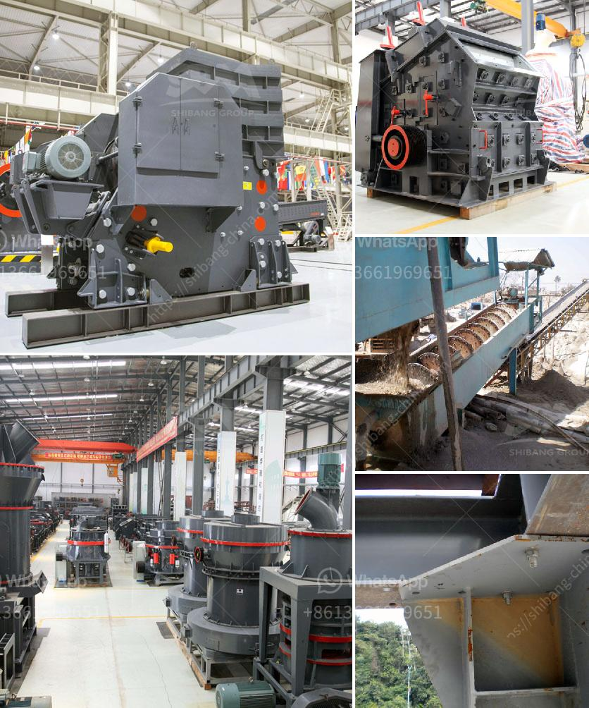

<h3>project cost of 100 tpd opc cement plant</h3>
The cement industry is one of the booming sectors in the construction industry, playing a vital role in the economic growth of any nation. Cement production is primarily divided into two categories - OPC (Ordinary Portland Cement) and PPC (Portland Pozzolana Cement). OPC cement plants are known for their robustness and versatility, making them the preferred choice for construction projects worldwide. This article aims to analyze the project cost associated with establishing a 100 TPD OPC cement plant.

Before delving into the project cost, it is crucial to understand the scope of the project. A 100 TPD OPC cement plant refers to the capacity of the Cement Plant, with an output of 100 tons per day (TPD) of Ordinary Portland Cement (OPC). This capacity may be achieved through a single unit or multiple units spread across various geographical locations.

1. Land and Site Development: The first step in establishing a cement plant is acquiring the land. The cost of land can vary based on its location, proximity to raw material sources, and infrastructure availability. Additionally, site development expenses such as leveling, fencing, and construction of roads are significant factors to consider.

2. Machinery and Equipment: The machinery and equipment required for a cement plant include crushers, kiln, preheater, raw mill, coal mill, cooler, cement mill, etc. The cost of these machinery and equipment is dependent on factors such as the technology level, scale of operations, and manufacturing location. It is important to choose reliable suppliers to ensure optimal performance and minimal maintenance costs.

3. Raw Materials and Utilities: OPC cement production requires raw materials such as limestone, shale, clay, iron ore, and gypsum. The cost of these raw materials is market-dependent. Additionally, utilities such as power and water play a significant role in cement production. The availability and reliability of these utilities impact the overall project cost.

4. Manpower and Labor: Labor is an essential component of any cement plant project. Identifying the required workforce, including skilled, semi-skilled, and unskilled workers, and estimating their wages, benefits, and accommodations is crucial.

5. Regulatory and Legal Compliance: Compliance with environmental regulations, obtaining necessary permits and certifications, and adhering to health and safety standards is essential. Legal and consultancy fees must be considered as part of the project cost.

6. Project Management and Miscellaneous Expenses: Project management expenses include costs related to consultants, engineers, architects, and other professionals involved in overseeing the project. Miscellaneous expenses encompass contingencies, insurance, administrative costs, etc.

Establishing a 100 TPD OPC cement plant requires a comprehensive analysis of various cost factors, including land acquisition, machinery and equipment, raw materials, labor, utilities, regulatory compliance, and project management. The project cost estimation should take into account market conditions, technological advancements, and the local regulatory environment.

It is advisable to consult experts in the cement industry, conduct feasibility studies, and benchmark against similar projects to ensure an accurate estimation of the project cost. Sound financial planning, careful cost analysis, and efficient project management are key factors in successfully establishing and operating a 100 TPD OPC cement plant.
<h3>Contact us</h3><ul><li><strong>Whatsapp:&nbsp;<a href="https://wa.me/8613661969651">+8613661969651</a></strong></li><li><a href="https://swt.shibang-china.com/?git&amp;zhl&amp;project cost of 100 tpd opc cement plant"><strong>Online Service(chat now)</strong></a></li></ul><h3>Related</h3><ul><li><a href='marble grinding machine dealers.md'>marble grinding machine dealers</a></li><li><a href='industrial mill price industrial mill.md'>industrial mill price industrial mill</a></li><li><a href='gold milling plant on small scale.md'>gold milling plant on small scale</a></li><li><a href='crusher for road base blue metal.md'>crusher for road base blue metal</a></li><li><a href='looking for limestone crushing contractor.md'>looking for limestone crushing contractor</a></li></ul>