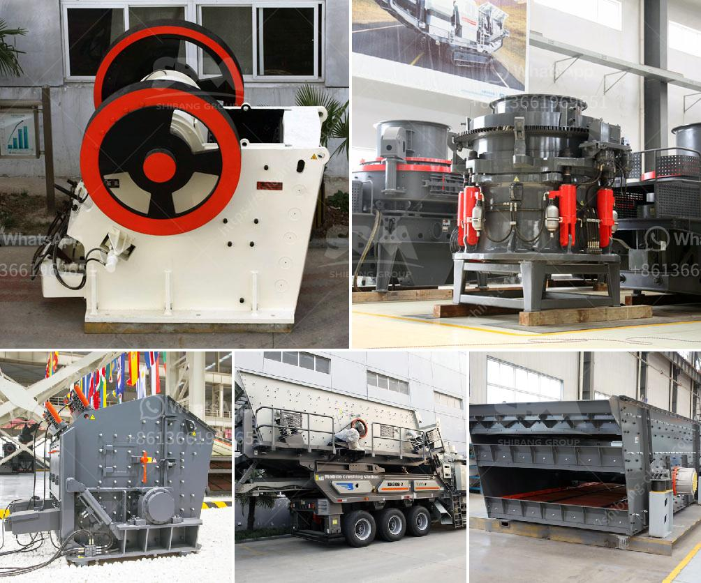

<h3>propel stone crusher</h3>
With the ever-growing construction and development projects, the demand for high-quality aggregates is skyrocketing. To meet this demand, engaging in efficient and cost-effective crushing processes is crucial. This leads to the need for leading-edge crushing equipment such as the Propel stone crusher.

When it comes to mastering the latest technology in crushing, innovative engineering and progressive solutions are the key ingredients. Propel Industries, an Indian-based construction equipment manufacturing company, is committed to providing high-quality crushing solutions to the Indian market and beyond.

The Propel stone crusher is designed with innovative features, such as ensuring operational efficiency, reliability, and consistent performance. It can crush wide variety of materials such as limestone, basalt, granite, river stone, coal, construction waste, etc. with capacity ranging from 50-250 tph.

The Propel stone crusher is equipped with advanced technologies and high-quality components that ensure optimal performance and ease of use. During operation, one can adjust the crushing size on the fly to produce various sized aggregates.

Its advanced design enables one to operate at maximum load, while maintaining ideal performance and handling. Its durable and strong power transmission system ensures smooth and uninterrupted workflow.

In addition, the Propel stone crusher comes with a host of user-friendly features like an advanced roto shaft, quick-change system for screening chambers, and a presence detector to help prevent glitches and ensure uninterrupted workflow.

The Propel stone crusher is an ideal choice for diverse applications and unlike the jaw and cone crushers, this efficient cone crusher is much lighter and smaller in size. Its compact structure and proven design ensure high availability, superior performance, and maximum productivity.

Whatever the crushing needs are, Propel stone crusher helps in improving overall operational efficiency and profitability. Propel also provides cost-effective spare parts because we make no compromise on the quality of our products, and our efficient and prompt after-sales service ensures that your operations are running flawlessly.

In conclusion, Propel stone crusher offers exceptional crushing capabilities at an affordable price. Along with the durability and user-friendly features, this makes it an ideal choice for personal use or for businesses. Propel Industries is a customer-oriented company and therefore, we strive to provide the best for our customers, ensuring efficient and reliable solutions.
<h3>Contact us</h3><ul><li><strong>Whatsapp:&nbsp;<a href="https://wa.me/8613661969651">+8613661969651</a></strong></li><li><a href="https://swt.shibang-china.com/?git&amp;zhl&amp;propel stone crusher"><strong>Online Service(chat now)</strong></a></li></ul><h3>Related</h3><ul><li><a href='mobile crusher plants.md'>mobile crusher plants</a></li><li><a href='supplier for crusher.md'>supplier for crusher</a></li><li><a href='ball mill pulverizer price.md'>ball mill pulverizer price</a></li><li><a href='mini jaw crusher for sale south africa.md'>mini jaw crusher for sale south africa</a></li><li><a href='hydrosizer sand making machine in south africa.md'>hydrosizer sand making machine in south africa</a></li></ul>