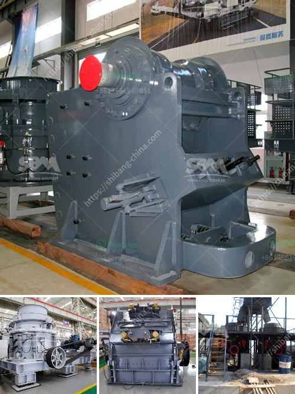

<h3>properties of gold mining in south africa</h3>
Gold mining in South Africa has a long history, dating back to the 1800s and since then it has evolved and remained a major contributor to the country's economy. Even though gold mining has significantly reduced in recent years, it still remains a lucrative activity for the country. Here are some key properties of gold mining in South Africa:

1. Rich Reserves: South Africa is one of the world's leading countries in terms of gold reserves. The country is home to some of the deepest and largest gold mines in the world. This rich endowment has been a major driving force behind the growth of the mining industry in South Africa.

2. Economic Impact: Gold mining has had a significant impact on the South African economy. It has been a major source of employment, creating jobs for thousands of people, both directly and indirectly. Furthermore, gold mining has attracted investment and stimulated economic growth in other sectors of the economy, such as infrastructure development and manufacturing.

3. Technological Advancements: Over the years, gold mining in South Africa has witnessed tremendous technological advancements. Modern mining methods and machinery are being used to extract gold from deep underground mines. These technologies have improved mining efficiency, reduced costs, and made operations safer for workers.

4. Environmental Concerns: Despite its economic benefits, gold mining in South Africa has also raised environmental concerns. The process of gold extraction often involves the use of toxic chemicals, such as cyanide, which can leach into water sources and contaminate the environment. The mining activities also disrupt natural habitats and ecosystems, impacting biodiversity.

5. Socio-economic Challenges: The gold mining industry in South Africa has also faced socio-economic challenges. Many mine workers come from impoverished communities and work in dangerous conditions for low wages. This has led to social issues, such as inequality, poverty, and high rates of HIV/AIDS. Efforts are being made by the government and industry stakeholders to address these challenges and improve working and living conditions for miners.

6. Legal Framework: The South African government has implemented a legal framework to regulate the gold mining industry. This includes ensuring the safety of mine workers, protecting the environment, and promoting sustainable mining practices. The Mineral and Petroleum Resources Development Act (MPRDA) is the primary legislation governing mining activities in the country.

7. Mining Companies: Several large mining companies operate in South Africa's gold sector, contributing to the industry's success. These include AngloGold Ashanti, Gold Fields, Harmony Gold, and Sibanye-Stillwater. These companies play a crucial role in the economy and are actively involved in community development projects, job creation, and environmental stewardship.

In conclusion, gold mining in South Africa remains an important economic activity despite the challenges it faces. The country's rich reserves, technological advancements, and legal framework have contributed to its success. However, there is a need for continuous efforts to address environmental concerns, improve working conditions, and promote sustainable mining practices to ensure a prosperous and responsible future for the gold mining industry in South Africa.
<h3>Contact us</h3><ul><li><strong>Whatsapp:&nbsp;<a href="https://wa.me/8613661969651">+8613661969651</a></strong></li><li><a href="https://swt.shibang-china.com/?git&amp;zhl&amp;properties of gold mining in south africa"><strong>Online Service(chat now)</strong></a></li></ul><h3>Related</h3><ul><li><a href='marble crusher manufacturer.md'>marble crusher manufacturer</a></li><li><a href='4 rolar raymond mill productions.md'>4 rolar raymond mill productions</a></li><li><a href='providers conveyor belts in bolivia.md'>providers conveyor belts in bolivia</a></li><li><a href='barite bulking process.md'>barite bulking process</a></li><li><a href='roller crusher brick making machine.md'>roller crusher brick making machine</a></li></ul>